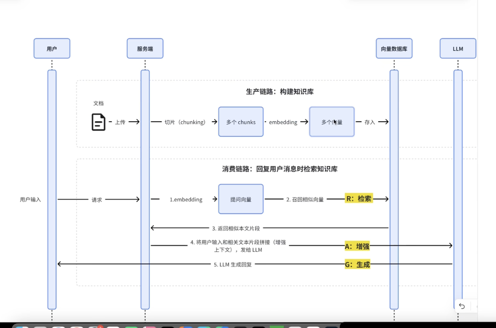
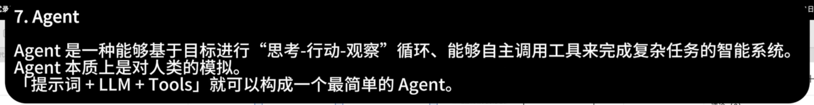
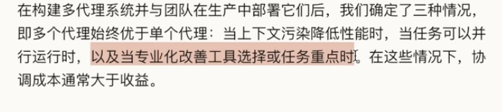
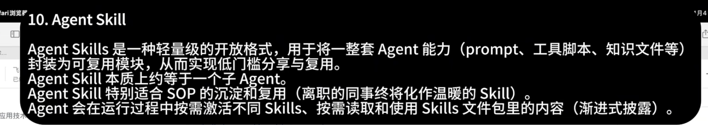
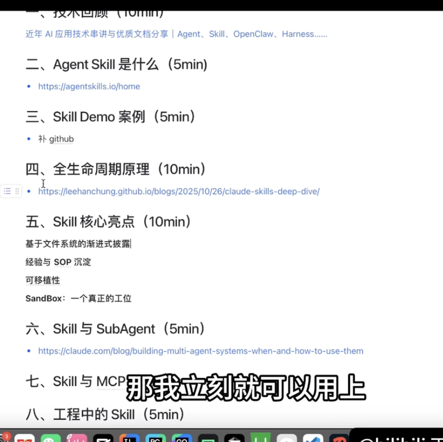
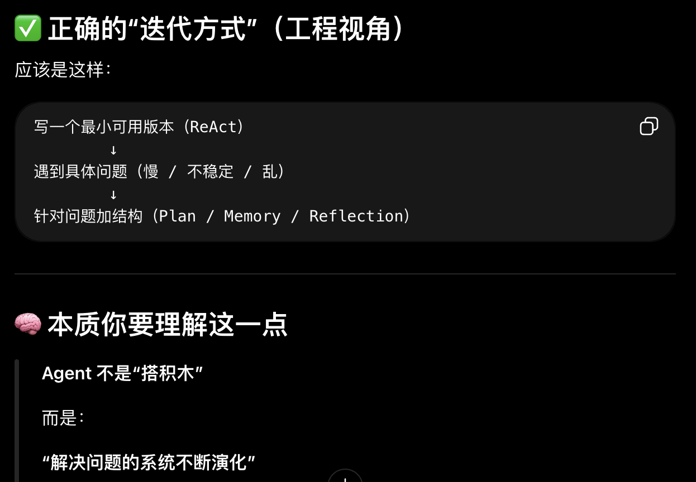

### 知识：

RAG架构画板

agentic search

好多要学的

要学习Context Engineering

**Sota版本的意思是> 当前这个领域“最强 / 最先进”的水平————拿我目前的AI举例就是：最好的模型。

问题

3
看小龙虾，看记忆管理+上下文管理

4
感觉function call还有好多其他的东西要学习

**感悟：

1

学习Agent项目方式：（这是一个idea）

