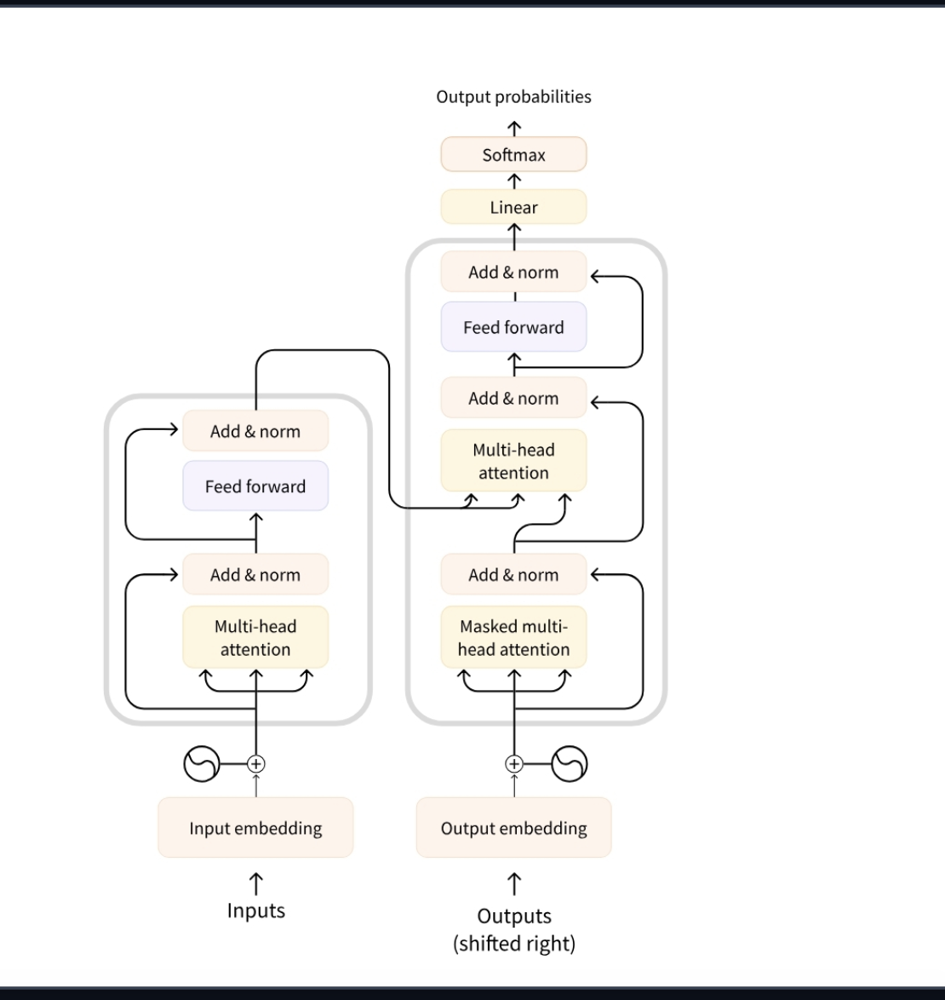

## 问题：
1
LLM是什么，不是只能生成文本，为什么还可以用工具
2

好多很有意思的术语比如attention
add&norm到底是啥意思

智能体中最常见的 AI 模型是 LLM（大型语言模型），它接受**文本**作为输入，并输出**文本**。

这里的“token”是 LLM 处理信息的基本单位

1. **现在的LLM(GPT、Claude)都是纯解码器**
    - 能理解,也能生成
    - 你用API调用的就是这种

##  LLMs 是如何工作的？

##  消息和特殊 Tokens (Messages and Special Tokens)

需要理解 LLMs 如何管理聊天

#### LLMs 的底层系统 (Messages: The Underlying System of LLMs)

问题：
1. **观察 (Observation)**：模型对工具的响应进行反思。
啥意思？
2
> 我们将介绍动作 (actions) 如何被表示（使用 JSON 或代码），停止和解析方法 (stop and parse approach) 的重要性，以及不同类型的智能体。

动作

- **工具集成 (Tool Integration)：**

调用工具（如天气 API）的能力使阿尔弗雷德能够**超越静态知识并检索实时数据**，这是许多 AI 智能体的重要方面。

- **动态适应 (Dynamic Adaptation)：**

每个循环都允许智能体将新信息（观察）整合到其推理（思考）中，确保最终答案是明智和准确的。

Agent（智能体）
├── LLM（大脑 - 负责思考、决策）
└── 框架代码（身体 - 负责执行、协调）
    ├── 工具管理（知道有哪些工具可用）
    ├── 工具执行（真的调用函数）
    └── 循环控制（把结果喂回 LLM，重复直到完成）

 ReAct 方法，是一种鼓励模型在行动前”逐步思考”的提示技术

智能体的一个关键部分是**在动作完成时能够停止生成新的标记 (tokens)**，这对所有格式的智能体都适用：JSON、代码或函数调用。这可以防止意外输出并确保智能体的响应清晰准确。

### 3. **`response.json()`**

- API 返回的数据通常是 JSON 格式（比如 `{"weather": "晴天", "temp": 25}`）
- `.json()` 把这个 JSON 字符串转成 Python 字典
4.Observation就是返thinking+action后返回的结果