## Function Calling

**问题：
1
传这么多参数是什么意思，要知道什么？
为什么使用函数描述比传统的系统提示词给AI，算事一个提升，因为写参数更方便吗（格式还要按照API提供商的）

**架构：**

**基于提示词的Function Calling：**

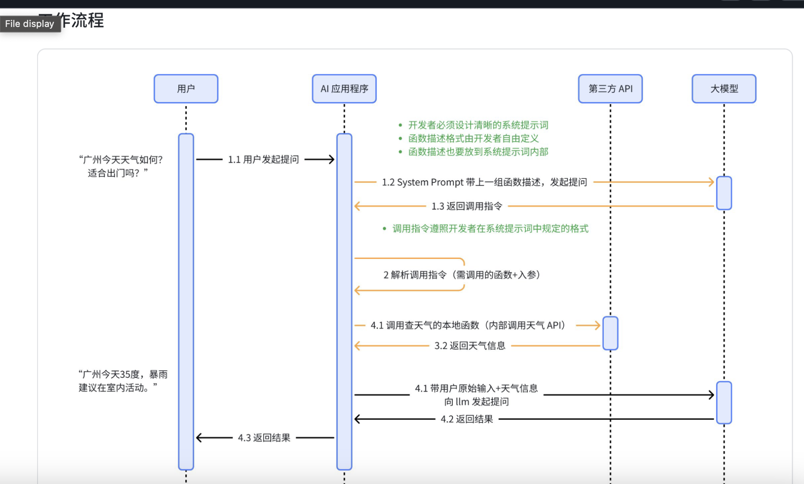


**基于API的Function Calling**：
 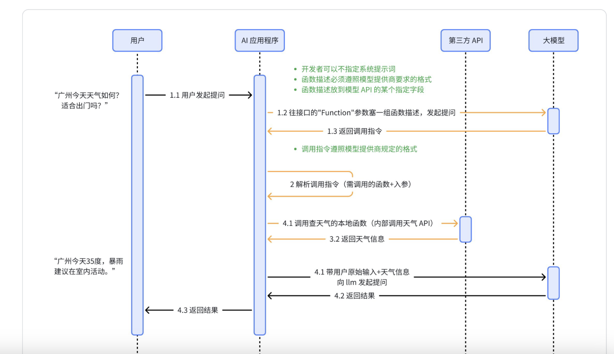

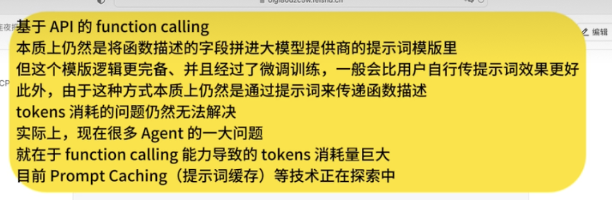


## MCP
### 知识

**1.为什么f1编号是f3
python

```python
import os

f1 = open("data.txt", "w")
f2 = open("log.txt", "w")

# 查看实际的fd编号
print(f1.fileno())  # 输出: 3
print(f2.fileno())  # 输出: 4

f1.close()
f2.close()
```
**回答：

**0, 1, 2已经被占用了！**

```
每个进程启动时，操作系统自动分配:
  fd 0 = stdin  (标准输入，键盘)
  fd 1 = stdout (标准输出，屏幕)
  fd 2 = stderr (标准错误，屏幕)

所以:
  你打开的第一个文件 → fd 3
  你打开的第二个文件 → fd 4
  你打开的第三个文件 → fd 5
```

**询问out.txt输出:

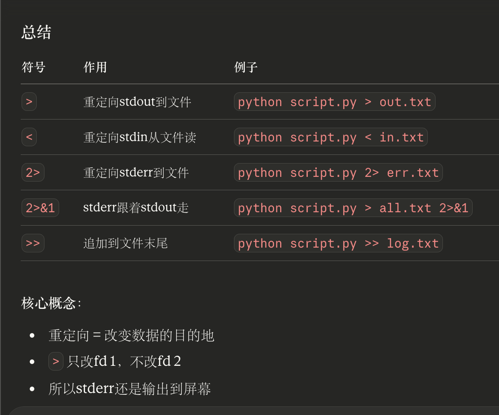

2
**为什么网络传输要用JSON字符串，而不是直接传Python字典？

- 网络只能传输字节流/字符串
- Python字典是内存中的数据结构，无法直接发送
- JSON是跨语言的文本格式，Python/Java/JS都能解析

3


4
**为什么MCP Stdio传输比文件共享更高效

- **快**：内存操作比硬盘I/O快几个数量级
- **实时**：数据即写即读，无需等待文件关闭
- **无垃圾文件**：不产生临时文件，不占用硬盘空间

5
**SSE与普通HTTP请求的核心区别是什么？

- 普通HTTP：Client请求 → Server立即完整响应 → 关闭
- SSE：Client请求 → Server保持连接 → 持续推送多条消息

6
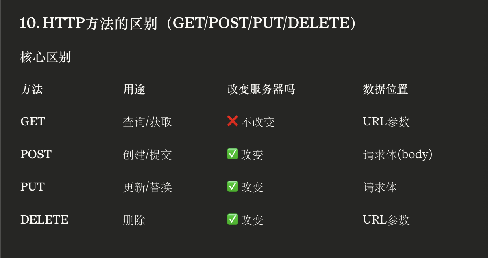

7
**MCP如何解决跨语言问题：

`Python进程 ←管道/HTTP→ Node.js进程(运行工具代码)`


8
**如何判断是否是Client-Server

**是Client-Server的条件**（三个都要满足）：

1. ✅ **有两个独立的进程** (浏览器进程 + 百度服务器进程)
2. ✅ **Server进程主动处理请求** (查数据库、计算、生成内容)
3. ✅ **Server返回的是"加工后的结果"** (不是原始文件)
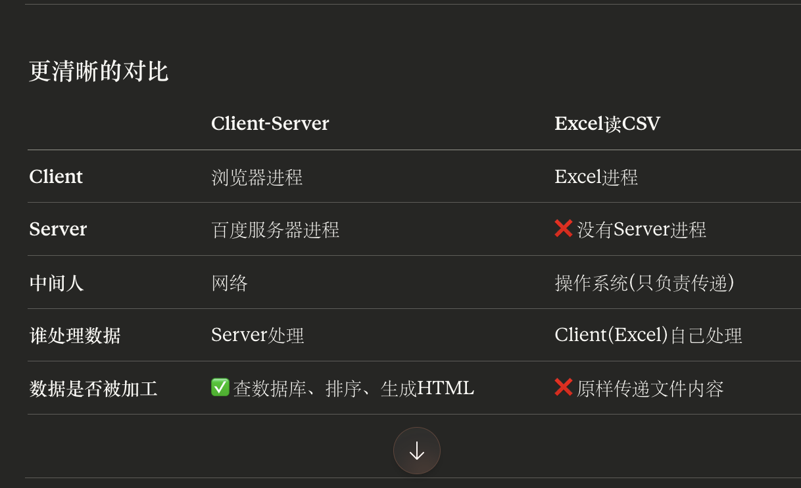

9
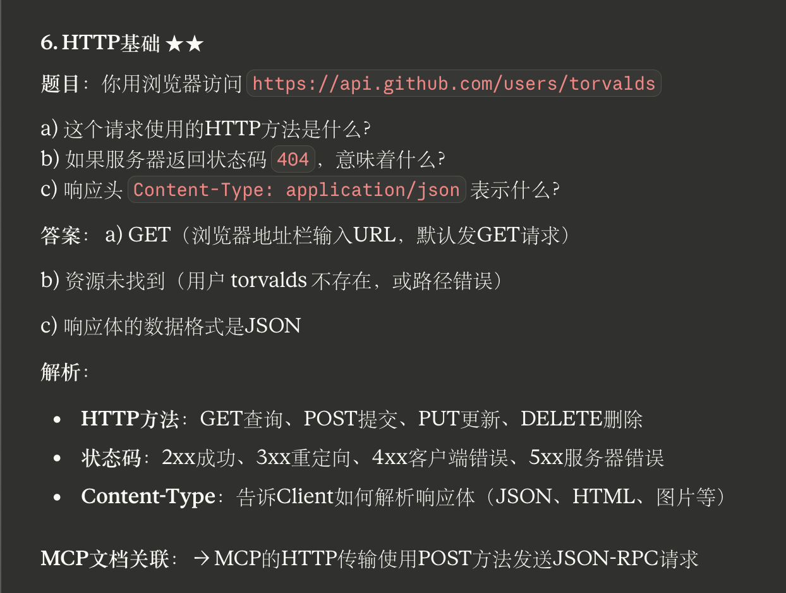

10

**MCP传输

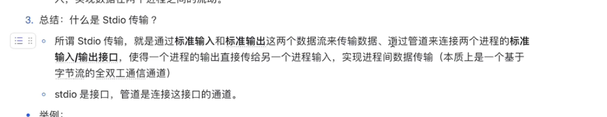


11
**SSE和HTTP核心差异：
支持服务端主动、流式地推送消息


12
**关于为什么要升级的问题

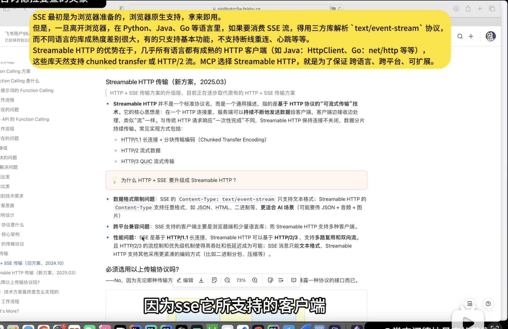

13

 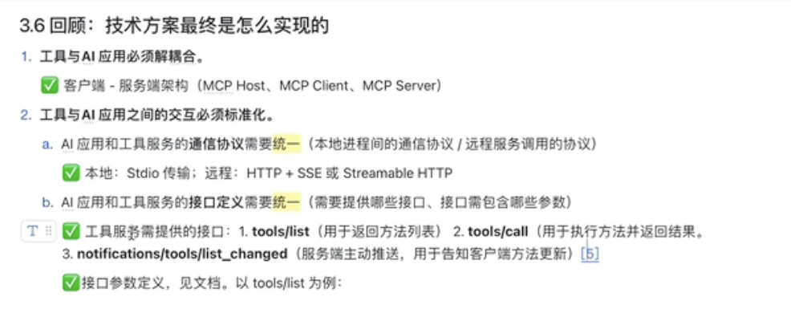

14不断抽象SDK的MCP协议和工具

15


16
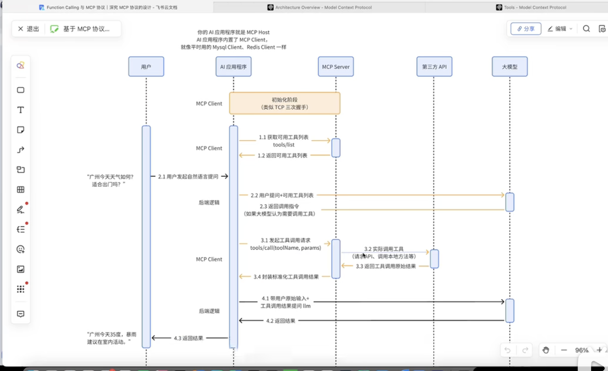
MCP里面交互里面发起可用工具列表和发起调用工具请求是不一样的

17
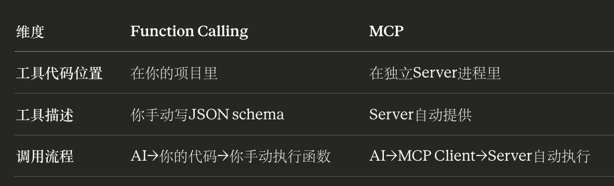

18
```
import的原理:
  1. 在当前语言的运行时环境中加载代码
  2. Python解释器只能执行Python代码
  3. JavaScript引擎只能执行JavaScript代码
```
19
配置：
说明

20
**协议 = 双方约定的通信规则**

HTTP协议：

```
约定:
  1. 请求格式: GET /path HTTP/1.1
  2. 响应格式: HTTP/1.1 200 OK
  3. 必须有空行分隔header和body
  
如果违反:
  服务器收到不符合格式的请求 → 拒绝处理
```
### MCP

**问题：

**逻辑

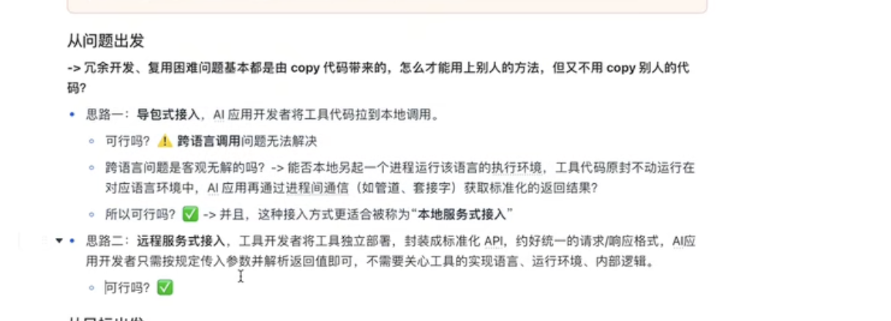
要实现的内容


需完成：
1
HTTP有时间就写


2
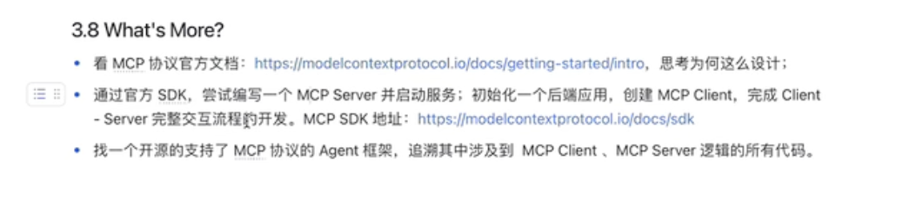
作业去做


配置是要解决这个问题吗 

**例子**:

python

```python
# Python中的文件操作
f = open("test.txt", "w")  # 内部得到一个fd,比如3
f.write("hello")           # 操作系统知道fd=3对应test.txt
f.close()                  # 释放fd=3
```

## 完整流程图

```
┌─────────────┐
│  你写配置    │
│ mcp_config  │
└──────┬──────┘
       │
       ↓
┌─────────────────────────────┐
│  AI应用启动(Claude Desktop) │
│  1. 读配置                  │
│  2. 执行: npx -y weather-tool│ ← 启动另一个进程
│  3. MCP Client连接到Server  │
│  4. 调用tools/list获取工具  │
└──────┬──────────────────────┘
       │
       ↓
┌────────────────────┐
│  工具已注册到AI应用  │ ← 这时候配置完成
└────────────────────┘

(用户提问)
       │
       ↓
┌──────────────────────┐
│  LLM决定调用get_weather│
└──────┬───────────────┘
       │
       ↓
┌──────────────────────────┐
│  MCP Client执行:         │
│  tools/call(get_weather) │ ← 通过管道发消息给weather-tool进程
└──────┬───────────────────┘
       │
       ↓
┌─────────────────────┐
│  weather-tool返回结果 │
└─────────────────────┘
```

---


**AI应用 vs LLM vs 工具 的区别

- **LLM** = 大脑(只负责思考/决策)
- **AI应用** = 身体+协调者(连接LLM和工具,提供界面)
- **工具** = 手脚(执行具体任务)


---


**解耦后(MCP方式)

python

```python
# AI应用代码(通用,不用改)
class AIApp:
    def __init__(self):
        self.mcp_client = MCPClient()  # MCP Client
        self.mcp_client.load_config()  # 读配置,启动MCP Server
    
    def chat(self, user_input):
        # 1. 从MCP获取工具列表(自动)
        tools = self.mcp_client.get_all_tools()
        
        # 2. 调用LLM
        response = llm.chat(messages=..., tools=tools)
        
        # 3. 如果LLM决定调用工具
        if response.tool_calls:
            tool_name = response.tool_calls[0].name
            tool_args = response.tool_calls[0].arguments
            
            # 4. 通过MCP Client调用(自动路由到正确的Server)
            result = self.mcp_client.call_tool(tool_name, tool_args)
            
            # 5. 结果给LLM
            final = llm.chat(...)
            return final


# 工具代码(独立的MCP Server)
# weather-tool/server.py
from mcp import Server

server = Server()

@server.tool()
def get_weather(city: str):
    return requests.get(f"api.com/weather?city={city}").json()

server.run()
```

**好处**:

- AI应用代码 → 永远不用改(通用逻辑)
- 工具代码 → 独立部署,更新不影响AI应用
- 配置连接两者 → 换工具只改配置

---


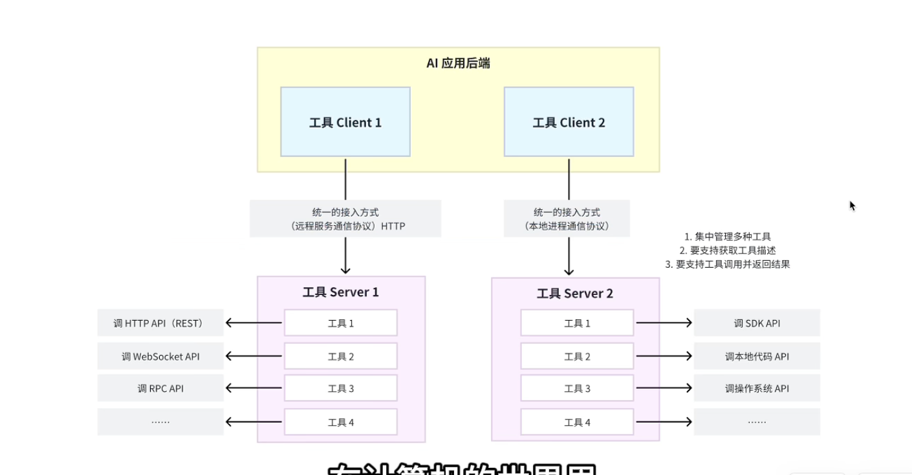

**"AI应用"指的是哪些？**

**AI应用（你写的使用AI能力的程序**） = 用户交互和LLM之间的这一层**，负责：

1. 接收用户输入
2. 调用LLM
3. 处理工具调用（通过MCP）
4. 返回最终结果给用户

**包含：**
1. MCP Client（调用工具）
2. LLM Client（调用AI）
3. 业务逻辑（你的应用代码）
4. 用户界面（如果有UI的话）

**管道是操作系统在内核空间维护的缓冲区