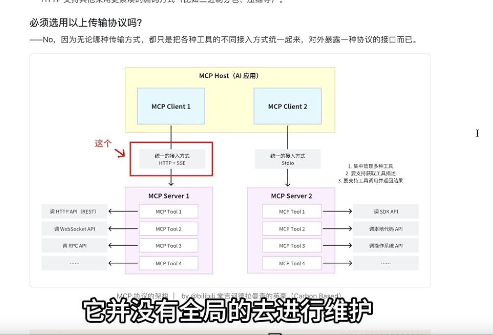
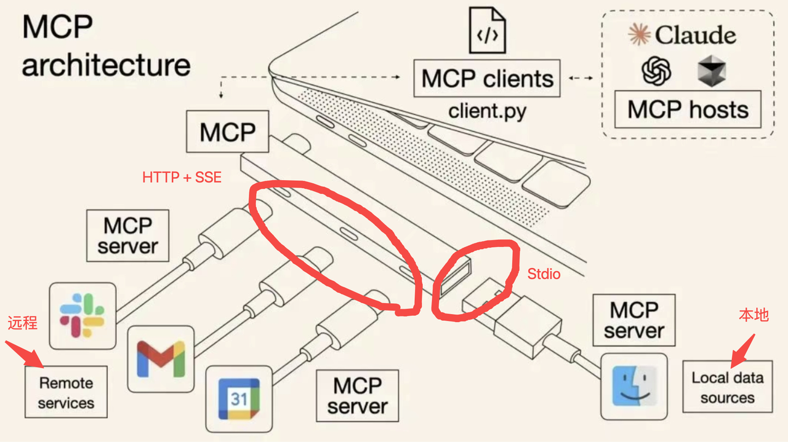

## Function Calling

**问题：
1
传这么多参数是什么意思，要知道什么？
为什么使用函数描述比传统的系统提示词给AI，算事一个提升，因为写参数更方便吗（格式还要按照API提供商的）

**架构：**

## MCP
### 知识

**1.为什么f1编号是f3
python

```python
import os

f1 = open("data.txt", "w")
f2 = open("log.txt", "w")

# 查看实际的fd编号
print(f1.fileno())  # 输出: 3
print(f2.fileno())  # 输出: 4

f1.close()
f2.close()
```
**回答：

**0, 1, 2已经被占用了！**

```
每个进程启动时，操作系统自动分配:
  fd 0 = stdin  (标准输入，键盘)
  fd 1 = stdout (标准输出，屏幕)
  fd 2 = stderr (标准错误，屏幕)

所以:
  你打开的第一个文件 → fd 3
  你打开的第二个文件 → fd 4
  你打开的第三个文件 → fd 5
```

**询问out.txt输出:


2
**为什么网络传输要用JSON字符串，而不是直接传Python字典？

- 网络只能传输字节流/字符串
- Python字典是内存中的数据结构，无法直接发送
- JSON是跨语言的文本格式，Python/Java/JS都能解析

3


4
**为什么MCP Stdio传输比文件共享更高效

- **快**：内存操作比硬盘I/O快几个数量级
- **实时**：数据即写即读，无需等待文件关闭
- **无垃圾文件**：不产生临时文件，不占用硬盘空间

5
**SSE与普通HTTP请求的核心区别是什么？

- 普通HTTP：Client请求 → Server立即完整响应 → 关闭
- SSE：Client请求 → Server保持连接 → 持续推送多条消息

6


7
**MCP如何解决跨语言问题：

`Python进程 ←管道/HTTP→ Node.js进程(运行工具代码)`


8
**如何判断是否是Client-Server

**是Client-Server的条件**（三个都要满足）：

1. ✅ **有两个独立的进程** (浏览器进程 + 百度服务器进程)
2. ✅ **Server进程主动处理请求** (查数据库、计算、生成内容)
3. ✅ **Server返回的是"加工后的结果"** (不是原始文件)


9


10

**MCP传输


11
**SSE和HTTP核心差异：
支持服务端主动、流式地推送消息


12
**关于为什么要升级的问题


13

 

14不断抽象SDK的MCP协议和工具

15


16

MCP里面交互里面发起可用工具列表和发起调用工具请求是不一样的

17


18
```
import的原理:
  1. 在当前语言的运行时环境中加载代码
  2. Python解释器只能执行Python代码
  3. JavaScript引擎只能执行JavaScript代码
```
19
配置：
说明

20
**协议 = 双方约定的通信规则**

HTTP协议：

```
约定:
  1. 请求格式: GET /path HTTP/1.1
  2. 响应格式: HTTP/1.1 200 OK
  3. 必须有空行分隔header和body
  
如果违反:
  服务器收到不符合格式的请求 → 拒绝处理
```
### MCP

**问题：
1
导包本质是不是csapp里面的链式调用问题

2
为什么需要通道，不同地方定义不同


自动完成调用+获取工具描述如果后端写的话，就需写很多代码是吧，加上不同AI应用迁移困难+拓展麻烦（因为需要再写代码），我现在没看MCP，但是我猜就是可以AI应用后端加入LLM自己去tool_calling，就是用LLM+tool_calling带后端逻辑替代原来所有后端的代码逻辑，需要获取工具信息的时候，就去tool_calling工具服务，需要执行就继续tool_calling API的服务（这里面还有就是本地服务和外部服务就是了，还有分就是这样代码确实整体实现了，但MCP好像封装了这些东西，怎么样封装的）。

但是现实：

LLM（决策）
   ↓
MCP Client Runtime
   ↓
协议通信
   ↓
Tool Server

3

**逻辑


要实现的内容

4
- **MCP Client**：一个组件，用于维护与 MCP 服务器的连接，并从 MCP 服务器获取上下文，供 MCP 主机使用

这个获取上下文是什么意思

5
从而保持MCP客户端与MCP服务器的一对一关系。
为什么要始终保持一对一？

6
### HTTP + SSE 传输（旧方案，2024.10）

> 客户端通过 HTTP POST 向服务端发请求，服务端通过 SSE 通道返回响应结果。

- **SSE**（Server-Sent Events服务器发送事件），是一种**服务器单向推送数据给客户端**的技术，基于 **HTTP 协议。**
    
- 基本原理
    
    - 客户端先向服务端发起一个普通的 **HTTP 请求**。
        
    - 服务端保持这个连接**不断开**，以 `text/event-stream` 作为响应类型，源源不断地往里写数据。
        
    - 客户端收到数据后会触发相应的事件回调（比如浏览器前端实时更新界面）。
        
- 和普通 HTTP 的核心差异
    
    - 支持服务端**主动、流式**地推送消息
        

为什么在这么多远程服务调用的协议中选了 HTTP + SSE？

- 服务端推送的必要性：MCP Server 中的工具发生了更新，需要主动向 MCP Client 推送通知
    

> **Why Notifications Matter**
> 
> This notification system is crucial for several reasons:
> 
> 1. Dynamic Environments: Tools may come and go based on server state, external dependencies, or user permissions
>     
> 2. Efficiency: Clients don’t need to poll for changes; they’re notified when updates occur
>     
> 3. Consistency: Ensures clients always have accurate information about available server capabilities
>     
> 4. Real-time Collaboration: Enables responsive AI applications that can adapt to changing contexts
>     
> 
> This notification pattern extends beyond tools to other MCP primitives, enabling comprehensive real-time synchronization between clients and servers. [[4]](https://modelcontextprotocol.io/docs/learn/architecture)

### Streamable HTTP 传输（新方案，2025.03）

> HTTP + SSE 传输方案的升级版，目前正在逐步取代原有的 HTTP + SSE 传输方案

- **Streamable HTTP** 并不是一个标准协议名，而是一个通用描述，指的是**基于 HTTP 协议的“可流式传输”技术**。它的核心思想是：在一个 HTTP 连接里，服务端可以**持续不断地发送数据**给客户端，客户端边接收边处理，类似“流”一样。与传统 HTTP 请求响应“一次性完成”不同，Streamable HTTP 保持连接不关闭，数据分片持续传输。常见实现方式包括：
    
    - HTTP/1.1 长连接 + 分块传输编码（Chunked Transfer Encoding）
        
    - HTTP/2 流式数据
        
    - HTTP/3 QUIC 流式传输
        

为什么 HTTP + SSE 要升级成 Streamable HTTP ？


HTTP + SSE不也支持服务器主动，流式推送数据。

7

HTTP要学啊


8
我想知道抽象到HTTP是为什么，本来直接调用API，会有什么问题，这样抽象


9

为什么不用比如说流还有随时更新？
需完成：
1
HTTP有时间就写


2

作业去做


配置是要解决这个问题吗 

**例子**:

python

```python
# Python中的文件操作
f = open("test.txt", "w")  # 内部得到一个fd,比如3
f.write("hello")           # 操作系统知道fd=3对应test.txt
f.close()                  # 释放fd=3
```

## 完整流程图

```
┌─────────────┐
│  你写配置    │
│ mcp_config  │
└──────┬──────┘
       │
       ↓
┌─────────────────────────────┐
│  AI应用启动(Claude Desktop) │
│  1. 读配置                  │
│  2. 执行: npx -y weather-tool│ ← 启动另一个进程
│  3. MCP Client连接到Server  │
│  4. 调用tools/list获取工具  │
└──────┬──────────────────────┘
       │
       ↓
┌────────────────────┐
│  工具已注册到AI应用  │ ← 这时候配置完成
└────────────────────┘

(用户提问)
       │
       ↓
┌──────────────────────┐
│  LLM决定调用get_weather│
└──────┬───────────────┘
       │
       ↓
┌──────────────────────────┐
│  MCP Client执行:         │
│  tools/call(get_weather) │ ← 通过管道发消息给weather-tool进程
└──────┬───────────────────┘
       │
       ↓
┌─────────────────────┐
│  weather-tool返回结果 │
└─────────────────────┘
```

---


**AI应用 vs LLM vs 工具 的区别

- **LLM** = 大脑(只负责思考/决策)
- **AI应用** = 身体+协调者(连接LLM和工具,提供界面)
- **工具** = 手脚(执行具体任务)


---


**解耦后(MCP方式)

python

```python
# AI应用代码(通用,不用改)
class AIApp:
    def __init__(self):
        self.mcp_client = MCPClient()  # MCP Client
        self.mcp_client.load_config()  # 读配置,启动MCP Server
    
    def chat(self, user_input):
        # 1. 从MCP获取工具列表(自动)
        tools = self.mcp_client.get_all_tools()
        
        # 2. 调用LLM
        response = llm.chat(messages=..., tools=tools)
        
        # 3. 如果LLM决定调用工具
        if response.tool_calls:
            tool_name = response.tool_calls[0].name
            tool_args = response.tool_calls[0].arguments
            
            # 4. 通过MCP Client调用(自动路由到正确的Server)
            result = self.mcp_client.call_tool(tool_name, tool_args)
            
            # 5. 结果给LLM
            final = llm.chat(...)
            return final


# 工具代码(独立的MCP Server)
# weather-tool/server.py
from mcp import Server

server = Server()

@server.tool()
def get_weather(city: str):
    return requests.get(f"api.com/weather?city={city}").json()

server.run()
```

**好处**:

- AI应用代码 → 永远不用改(通用逻辑)
- 工具代码 → 独立部署,更新不影响AI应用
- 配置连接两者 → 换工具只改配置

---


**"AI应用"指的是哪些？**

**AI应用（你写的使用AI能力的程序**） = 用户交互和LLM之间的这一层**，负责：

1. 接收用户输入
2. 调用LLM
3. 处理工具调用（通过MCP）
4. 返回最终结果给用户

**包含：**
1. MCP Client（调用工具）
2. LLM Client（调用AI）
3. 业务逻辑（你的应用代码）
4. 用户界面（如果有UI的话）

**管道是操作系统在内核空间维护的缓冲区


MCP里面-本地进程间通信， stdio 是接口，管道是连接这接口的通道。

Stdio 传输，就是通过**标准输入**和**标准输出**这两个数据流来传输数据、通过管道来连接两个进程的**标准输入/输出接口**，使得一个进程的输出直接传给另一个进程输入，实现进程间数据传输




好有意思的图，很通俗易懂