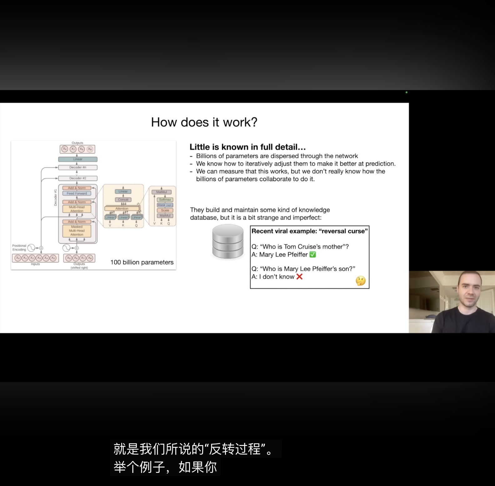

LLAMA开源模型可以学
### 问题：
1什么叫700亿参数的模型，700亿参数是什么意思
**参数 = 模型内部可以调整的数字（权重）**

一个 700 亿参数的模型，意味着它内部有 **700 亿个可以调整的数字**，这些数字决定了模型的行为。
什么是GPU

2】
啥意思

经验产物，慢慢优化

推理：
训练副本是有损压缩。

神经网络就是可以帮忙预测 ————推理的基石

问题
1要熟悉Transformer神经网络图
2什么是RHF
3
LLM Scaling Laws是什么意思
4
LLM自己利用工具，比如视频里面提及到的浏览器+计数器+python绘图，跟agent里面tool使用有什么区别，LLM不是本来就可以用tool完成任务吗
5
模型的定制化是什么意思（不完全解决，但是结果有RAG和微调，很有意思的问题）
感悟
1
内层：神经网络如何工作，如何执行预测，内部机制？

2
先注重数量再质量

微调：把知识转化成助手问答形式。价格便宜比预训练。微调后期要监测异常。fix bug，用正确回答覆盖原理错误的回答。

3
推理：
训练副本是有损压缩。

神经网络就是可以帮忙预测 ————推理的基石

4
提示注入攻击：有意思后面我可以设计一下 

5

LLM出现幻觉的意思是：

6
Agent和模型调用tool————感觉没区别，Agent很像LLM + 工具调用循环，主要是在与多层推理+循环

7

模型的定制化是什么意思（不完全解决，但是结果有RAG和微调，很有意思的问题）：

