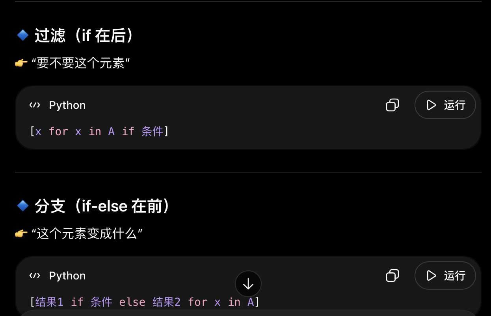
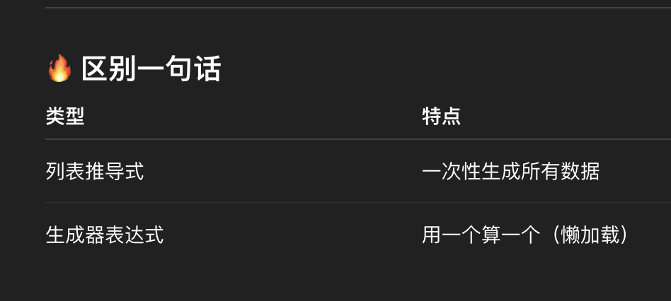
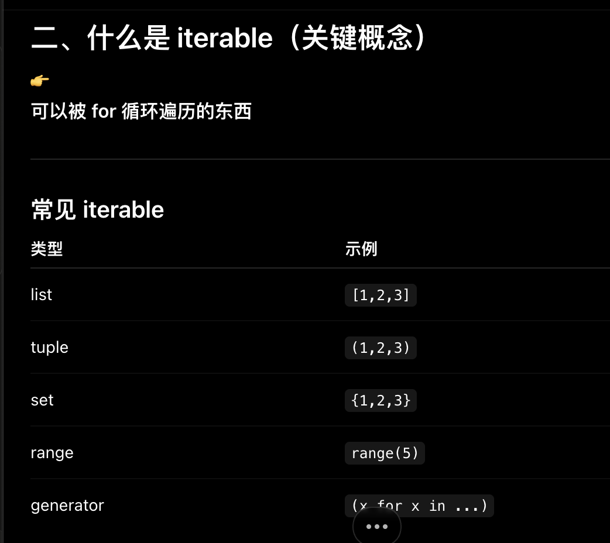
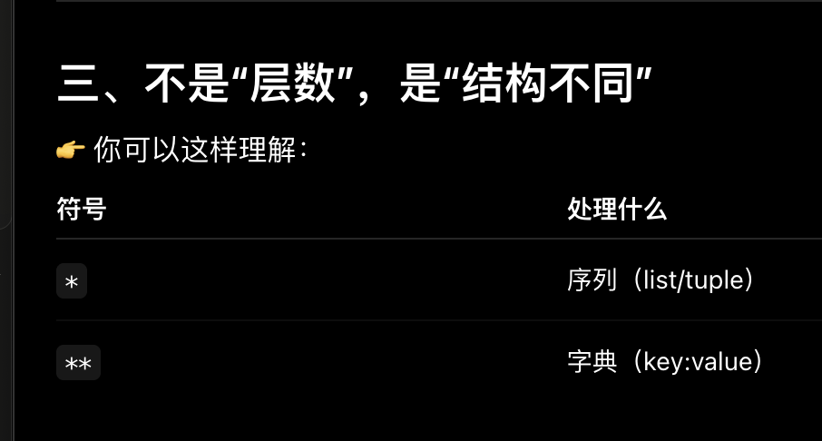

复习+1


## 函数基础
---

2
`**kwargs` 的作用：

def f(a, *****kwargs):  
    print(kwargs)

f(a=1, b=2, c=3)

👉 Python在背后做了这件事：

kwargs = {  
    "b": 2,  
    "c": 3  
}
****用来把{}拆掉


5
**类型注解写错有关系吗：

**原因**：

- Python的类型注解是"提示"，不是"强制检查"
    
- 运行时Python不会验证类型
    
- IDE会警告你类型错误，但代码能运行


6
**函数定义传参两种调用方式

**位置参数

connect("localhost", 9000)

**关键字参数

connect(port=9000, host="localhost")

7
**生成器表达式 vs 列表推导式

列表推导式：
[x * 2 for x in range(5)]

**拓展：



生成器表达式：
(x * 2 for x in range(5))



8
Lambda vs 普通函数：

```python
# Lambda（单行）
add = lambda a, b: a + b

# 普通函数（多行）
def add(a, b):
    return a + b

# Lambda的限制：
# ✅ 可以：单个表达式
# ❌ 不可以：多行语句、if/for等
```
## OOP

1
👉 `__init__` = **对象创建时自动执行的初始化函数**

2
```python
# Python 写法
class Person:
    def __init__(self, name, age):  # 构造函数
        self.name = name
        self.age = age
    
    def greet(self):
        print(f"Hello, I'm {self.name}")
```
传这个self是干嘛的

**解答：
👉 **不是每个 `def` 都要写 `self`**

👉 只有一种情况需要：

> ✅ **写在 class 里面的“方法”必须写 `self


3


3

对于**kwargs（原本kwargs是词典形式）和*args(args原本是列表形式)的理解：



5
import time

# 装饰器：统计函数运行时间
def display_time(func):
    def wrapper():
        t1 = time.time()
        result = func()          # 调用原函数
        t2 = time.time()
        print(f"Total time: {t2 - t1:.6f} s")
        return result            # 把原函数结果返回
    return wrapper               # 返回包装后的函数


# 判断是否是质数
def is_prime(num):
    if num < 2:
        return False
    elif num == 2:
        return True
    else:
        for i in range(2, num):
            if num % i == 0:
                return False
        return True


# 使用装饰器
@display_time
def count_prime_nums():
    count = 0
    for i in range(2, 10000):
        if is_prime(i):
            count += 1
    return count


@display_time  
def count():  
    return 123

👉 实际等价于：

def count():  
    return 123  
  
count = display_time(count)

**逻辑：

调用者 → wrapper → func

👉 参数流：

10000 → wrapper → func

先传给wrapper才传给func


（死装饰器这么难，我先干别的去了）

6
  

Python类的特点：

  

1. **构造函数是 `__init__`**：

```python

class MyClass:

def __init__(self, value): # 名字固定

self.value = value

```

  

2. **self必须显式写**：

```python

class MyClass:

def method(self): # 第一个参数必须是self

print(self.value)

```

  

3. **动态特性**：

```python

obj = MyClass(5)

obj.new_attr = "dynamic" # 可以随时添加属性

```


问题：
我这个继承晕不拉几的，后面写代码找问题


### 逻辑：
## 问题：

5
### 7. 魔术方法（str、repr、or）

**是什么**： 魔术方法（Magic Methods）是以双下划线开头和结尾的特殊方法，定义对象的特殊行为。

**Java 类比**：

```java
// Java 的toString()
public class Person {
    private String name;
    
    @Override
    public String toString() {  // 魔术方法的Java等价
        return "Person(name=" + name + ")";
    }
}

System.out.println(p);  // 自动调用toString()
```

**Python 写法**：

```python
# Python 魔术方法
class Person:
    def __init__(self, name):
        self.name = name
    
    def __str__(self):  # 相当于Java的toString()
        return f"Person(name={self.name})"
    
    def __repr__(self):  # 开发者友好的表示
        return f"Person('{self.name}')"

p = Person("Alice")
print(p)       # 调用 __str__() → "Person(name=Alice)"
print(repr(p)) # 调用 __repr__() → "Person('Alice')"
```

**过程思维**：

```
__str__ vs __repr__:
  p = Person("Alice")
  
  print(p)
    → Python调用 str(p)
    → str(p) 调用 p.__str__()
    → 输出 "Person(name=Alice)"
  
  repr(p)
    → 调用 p.__repr__()
    → 输出 "Person('Alice')"

运算符重载（__or__）：
  class Chain:
      def __or__(self, other):  # 重载 | 运算符
          return f"Chain({self}, {other})"
  
  a = Chain()
  b = Chain()
  result = a | b
    → Python调用 a.__or__(b)
    → 返回 "Chain(..., ...)"
```

**在 LangChain 中的实际应用**：

```python
# 来自你的目标代码
chain = prompt | chat | parser
# 这里的 | 运算符被重载了
# 相当于 prompt.__or__(chat).__or__(parser)

# LangChain内部实现（简化版）：
class Runnable:
    def __or__(self, other):  # 重载 | 运算符
        return RunnableSequence(self, other)

prompt = PromptTemplate(...)
chat = ChatOpenAI()
# prompt | chat
# → 调用 prompt.__or__(chat)
# → 返回 RunnableSequence([prompt, chat])
```

**常用魔术方法**：

```python
class Example:
    # 对象创建和表示
    def __init__(self, value):      # 构造函数
        self.value = value
    
    def __str__(self):              # print(obj)
        return f"Example({self.value})"
    
    def __repr__(self):             # repr(obj), 调试用
        return f"Example(value={self.value})"
    
    # 运算符重载
    def __add__(self, other):       # obj1 + obj2
        return self.value + other.value
    
    def __or__(self, other):        # obj1 | obj2
        return f"{self} | {other}"
    
    # 比较
    def __eq__(self, other):        # obj1 == obj2
        return self.value == other.value
    
    # 容器协议
    def __len__(self):              # len(obj)
        return len(self.value)
    
    def __getitem__(self, key):     # obj[key]
        return self.value[key]
```

**关键差异（vs Java）**：

- ❌ Java 只有少数可重载的方法（toString, equals, hashCode）
    
- ✅ Python 可以重载几乎所有运算符（+、-、*、/、|、==、<、[]...）
    
- ✅ Python 的魔术方法统一命名：`__method__`

这个魔术方法是干嘛的，为什么Java的感觉很糊


### 8. 装饰器（@decorator）

**是什么**： 装饰器是包装函数的函数，可以在不修改原函数代码的情况下添加功能。

**Java 类比**： Java没有装饰器，但可以用代理模式或注解：

```java
// Java 注解（语法类似，但原理不同）
@Override
public void method() { }

// Java 代理模式（功能类似装饰器）
public interface Service {
    void execute();
}

public class LoggingProxy implements Service {
    private Service realService;
    
    public void execute() {
        System.out.println("Before");
        realService.execute();
        System.out.println("After");
    }
}
```

**Python 写法**：

```python
# 定义装饰器
def log_calls(func):
    def wrapper(*args, **kwargs):
        print(f"Calling {func.__name__}")
        result = func(*args, **kwargs)
        print(f"Finished {func.__name__}")
        return result
    return wrapper

# 使用装饰器
@log_calls
def greet(name):
    return f"Hello {name}"

# 调用
greet("Alice")
# 输出:
# Calling greet
# Finished greet
# 返回: "Hello Alice"
```

**过程思维**：

```
装饰器的本质：
  @log_calls
  def greet(name):
      return f"Hello {name}"
  
  等价于：
  def greet(name):
      return f"Hello {name}"
  greet = log_calls(greet)  # 包装原函数

执行过程：
  greet("Alice")
    1. greet 已经被 log_calls 包装
    2. 实际调用 wrapper("Alice")
    3. wrapper内部：
       - 打印 "Calling greet"
       - 调用原始的 greet("Alice")
       - 打印 "Finished greet"
       - 返回结果
```

**在 LangChain 中的实际应用**：

```python
# 来自你的目标代码 和 tools_agents.ipynb
from langchain.tools import tool

@tool
def get_current_weather(location: str) -> str:
    """当你想查询指定城市的天气时非常有用。"""
    return f"{location}今天是雨天。"

# @tool 装饰器的作用：
# 1. 把普通函数包装成 LangChain 工具
# 2. 自动提取函数签名（参数类型）
# 3. 自动提取文档字符串（作为工具描述）
# 4. 返回一个 Tool 对象

# 等价于：
def get_current_weather(location: str) -> str:
    """当你想查询指定城市的天气时非常有用。"""
    return f"{location}今天是雨天。"

get_current_weather = tool(get_current_weather)
```

**带参数的装饰器**：

```python
# 定义带参数的装饰器
def repeat(n):
    def decorator(func):
        def wrapper(*args, **kwargs):
            for i in range(n):
                result = func(*args, **kwargs)
            return result
        return wrapper
    return decorator

# 使用
@repeat(3)
def greet(name):
    print(f"Hello {name}")

greet("Alice")
# 输出:
# Hello Alice
# Hello Alice
# Hello Alice
```

**关键差异（vs Java）**：

- ❌ Java 的注解是编译时处理，不能修改方法行为
    
- ✅ Python 的装饰器是运行时包装，可以完全改变函数行为
    
- ✅ Python 装饰器可以堆叠：`@decorator1 @decorator2 def func()`

这个装饰器内容看不懂（后面看一下要不要看视频）