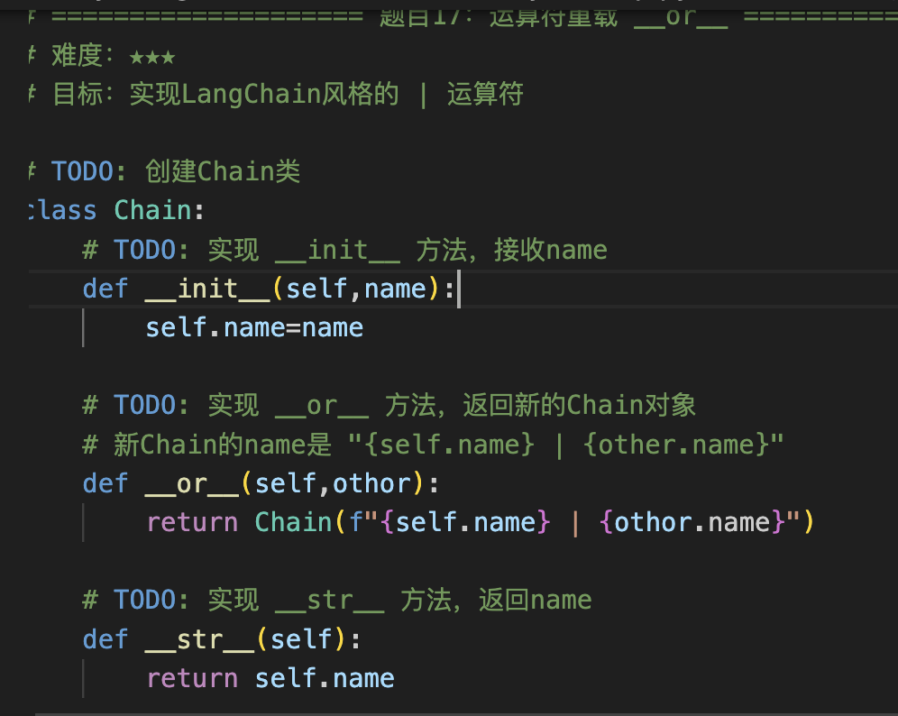

复习+1


## 函数基础
---

2
`**kwargs` 的作用：

def f(a, *****kwargs):  
    print(kwargs)

f(a=1, b=2, c=3)

👉 Python在背后做了这件事：

kwargs = {  
    "b": 2,  
    "c": 3  
}
****用来把{}拆掉


5
**类型注解写错有关系吗：

**原因**：

- Python的类型注解是"提示"，不是"强制检查"
    
- 运行时Python不会验证类型
    
- IDE会警告你类型错误，但代码能运行


6
**函数定义传参两种调用方式

**位置参数

connect("localhost", 9000)

**关键字参数

connect(port=9000, host="localhost")

7
**生成器表达式 vs 列表推导式

列表推导式：
[x * 2 for x in range(5)]

**拓展：


生成器表达式：
(x * 2 for x in range(5))


8
Lambda vs 普通函数：

```python
# Lambda（单行）
add = lambda a, b: a + b

# 普通函数（多行）
def add(a, b):
    return a + b

# Lambda的限制：
# ✅ 可以：单个表达式
# ❌ 不可以：多行语句、if/for等
```
## OOP

1
👉 `__init__` = **对象创建时自动执行的初始化函数**

2
```python
# Python 写法
class Person:
    def __init__(self, name, age):  # 构造函数
        self.name = name
        self.age = age
    
    def greet(self):
        print(f"Hello, I'm {self.name}")
```
传这个self是干嘛的

**解答：
👉 **不是每个 `def` 都要写 `self`**

👉 只有一种情况需要：

> ✅ **写在 class 里面的“方法”必须写 `self


3


3

对于**kwargs（原本kwargs是词典形式）和*args(args原本是列表形式)的理解：


5
import time

# 装饰器：统计函数运行时间
def display_time(func):
    def wrapper():
        t1 = time.time()
        result = func()          # 调用原函数
        t2 = time.time()
        print(f"Total time: {t2 - t1:.6f} s")
        return result            # 把原函数结果返回
    return wrapper               # 返回包装后的函数


# 判断是否是质数
def is_prime(num):
    if num < 2:
        return False
    elif num == 2:
        return True
    else:
        for i in range(2, num):
            if num % i == 0:
                return False
        return True


# 使用装饰器
@display_time
def count_prime_nums():
    count = 0
    for i in range(2, 10000):
        if is_prime(i):
            count += 1
    return count


@display_time  
def count():  
    return 123

👉 实际等价于：

def count():  
    return 123  
  
count = display_time(count)

**逻辑：

调用者 → wrapper → func

👉 参数流：

10000 → wrapper → func

先传给wrapper才传给func


（死装饰器这么难，我先干别的去了）

6
  

Python类的特点：

  

1. **构造函数是 `__init__`**：

```python

class MyClass:

def __init__(self, value): # 名字固定

self.value = value

```

  

2. **self必须显式写**：

```python

class MyClass:

def method(self): # 第一个参数必须是self

print(self.value)

```

**7. 魔术方法（str、repr、or）

在python里面全部都是对象


class Person:  
def __init__(self, age):  
self.age = age  
  
p1 = Person(20)  
p2 = Person(30)  
  
p1 + p2 # ❌ 报错


👉 **所有运算本质都是方法调用**

但是：

- 内置类型 → 已经帮你写好了
- 自定义类型 → 你决定行为

---

👉 **Python允许自定义类参与各种语法（+、len、[] 等），前提是你实现对应的魔术方法**

👉 **Java不允许这样做，运算符行为是固定的**




我不用管｜是管道的意思，只要知道a|b在这里是转化a.__or__(b)到这一层，然后实际读代码要知道这里是流水线的，分开理解

问题：
我这个继承晕不拉几的，后面写代码找问题


## 第三层：高级特性
### 9. 迭代器与生成器（yield）

```python
# Python 生成器（简单很多）
def counter(max):
    current = 0
    while current < max:
        yield current  
        # 暂停并返回值(永远记住每次暂停一次都把当前的比如current的数值返回给外界，比如下面是num来接住current的数值。)
        current += 1

# 使用
for num in counter(5):
    print(num)  # 0, 1, 2, 3, 4
```

**底层：

```python
# Python 生成器（简单很多）
def counter(max):
    current = 0
    while current < max:
        yield current  
        # 暂停并返回值(永远记住每次暂停一次都把当前的比如current的数值返回给外界，比如下面是num来接住current的数值，最后到StopIteration出去。)
        current += 1

gen = counter(5)   # 创建 generator（函数还没执行）  
  
while True:  
    try:  
        num = next(gen)   # 👈 关键  ————>这里触发执行counter的内容，回去counter函数执行
        print(num)  
    except StopIteration:  
        break

```

** ① `for ... in`（迭代器循环）✅

for x in something:  
    ...

👉 **底层就是：不断调用 `next()`**

只要是这种写法：

- list
- generator
- 字符串
- 文件


### 10. 上下文管理器（with 语句）


问题：

**是什么**： 上下文管理器确保资源正确初始化和清理（如文件自动关闭）。

**Java 类比**：

```java
// Java try-with-resources (Java 7+)
try (FileReader fr = new FileReader("data.txt")) {
    // 使用文件
    int data = fr.read();
}  // 自动调用 fr.close()
```

**Python 写法**：

```python
# Python with 语句
with open("data.txt") as f:
    content = f.read()
# 自动调用 f.close()，即使发生异常
```
这是什么意思？？


2
```

执行流程：
  with open("data.txt") as f:
      content = f.read()
  
  1. 调用 open("data.txt")，返回文件对象
  2. 调用 f.__enter__()（进入上下文）
  3. 把返回值赋给 f
  4. 执行 with 代码块
  5. 退出代码块时，调用 f.__exit__()（清理资源）
  6. 即使发生异常，也会调用 __exit__()
```
这个逻辑再给我说一下，不懂

3
**定义上下文管理器**：

```python
class DatabaseConnection:
    def __enter__(self):
        print("Opening connection")
        self.conn = "connection_object"
        return self.conn
    
    def __exit__(self, exc_type, exc_val, exc_tb):
        print("Closing connection")
        # 即使出错也会执行清理

# 使用
with DatabaseConnection() as conn:
    print(f"Using {conn}")
# 输出:
# Opening connection
# Using connection_object
# Closing connection
```

**关键差异（vs Java）**：

- ✅ Python 的 `with` 更简洁
    
- ✅ Java 的 try-with-resources 只支持 AutoCloseable 接口
    
- ✅ Python 的上下文管理器更通用（**enter**/**exit**）
- 搞啥看不懂

### 11. 异步基础（async/await）


**问题：
1
等待I/O时执行其他任务，提高并发性能
啥意思

2
```

异步（非阻塞）：
  async def task1():
      await asyncio.sleep(2)  # 非阻塞等待
      return "task1"
  
  async def task2():
      await asyncio.sleep(2)  # 非阻塞等待
      return "task2"
  
  async def main():
      results = await asyncio.gather(task1(), task2())
  # task1和task2同时执行
  # 总共2秒（并发）

执行流程（简化）：
  async def fetch():
      print("Start")
      await asyncio.sleep(1)  # 暂停，让出控制权
      print("End")
      return "data"
  
  1. 调用 fetch()
  2. 打印 "Start"
  3. 遇到 await，暂停函数，返回事件循环
  4. 事件循环可以执行其他任务
  5. 1秒后，恢复 fetch()
  6. 打印 "End"
  7. 返回 "data"
```

这个执行流程讲解一下+非阻塞是什么意思，在代码里面

### 11. 异步基础（async/await）

**是什么**： 异步编程允许在等待I/O时执行其他任务，提高并发性能。

**Java 类比**：

```java
// Java CompletableFuture
CompletableFuture<String> future = CompletableFuture.supplyAsync(() -> {
    return fetchData();  // 异步执行
});

future.thenAccept(result -> {
    System.out.println(result);
});
```

**Python 写法**：

```python
import asyncio

# 定义异步函数
async def fetch_data():
    await asyncio.sleep(1)  # 异步等待（不阻塞）
    return "data"

# 调用异步函数
async def main():
    result = await fetch_data()
    print(result)

# 运行
asyncio.run(main())
```

**问题：
1事件循环是什么意思，在写项目的时候，感觉很复杂

**易错：
**```
同步（阻塞） vs 异步（非阻塞）：

同步逻辑清晰，按照逻辑一步一步来。但是复杂项目时间效率低。

异步复杂，执行顺序不直观，“暂停+切换”，修改成本高。但是复杂项目时间效率高。


