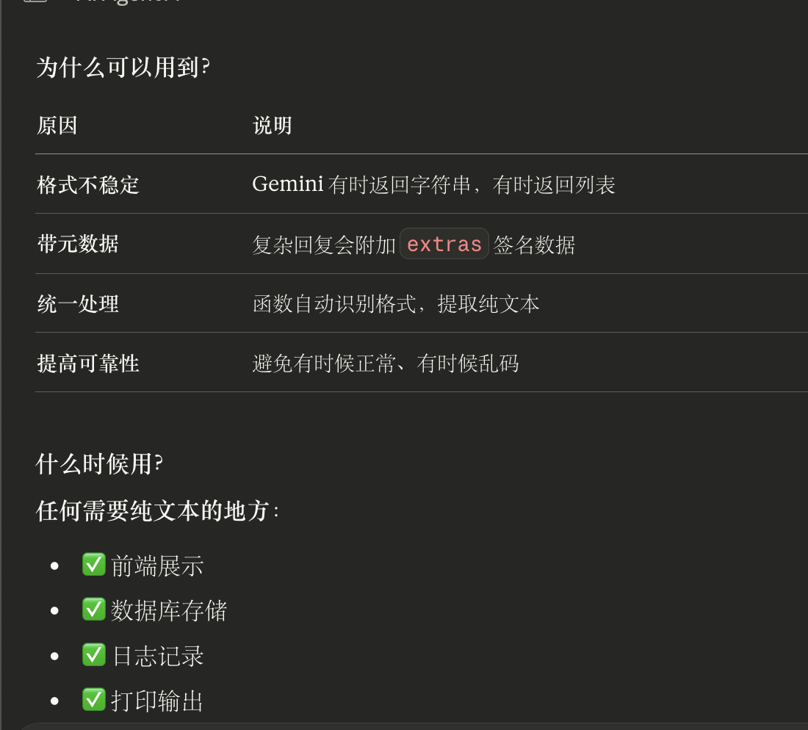
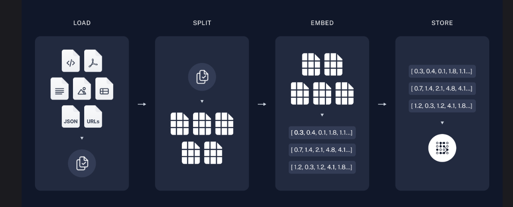
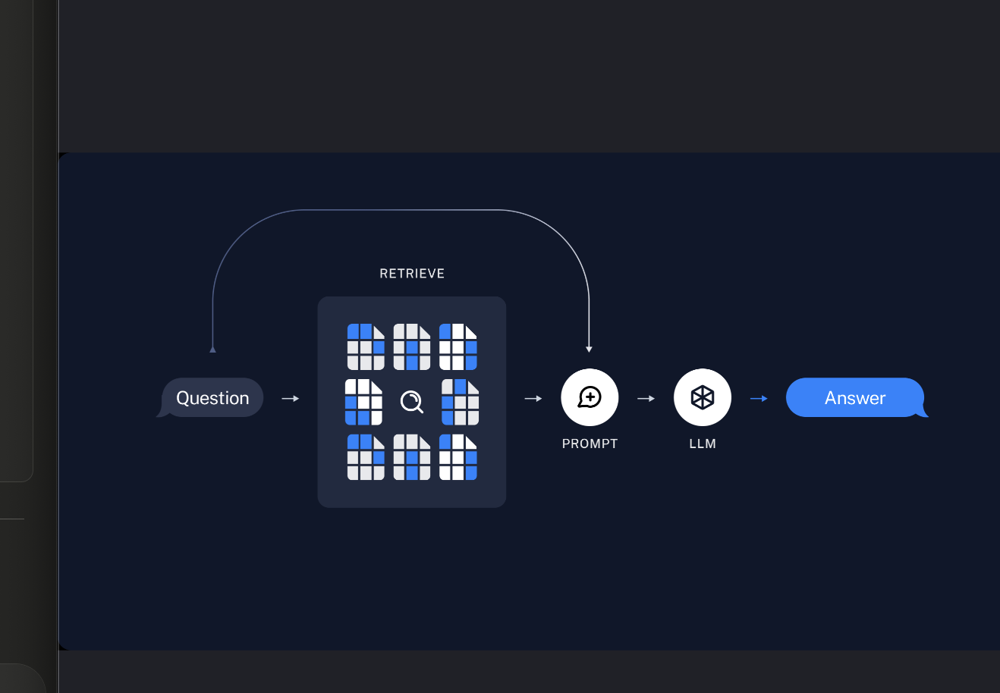
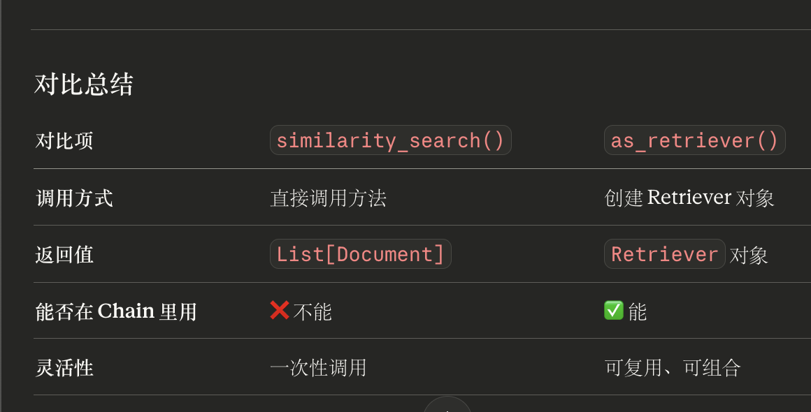
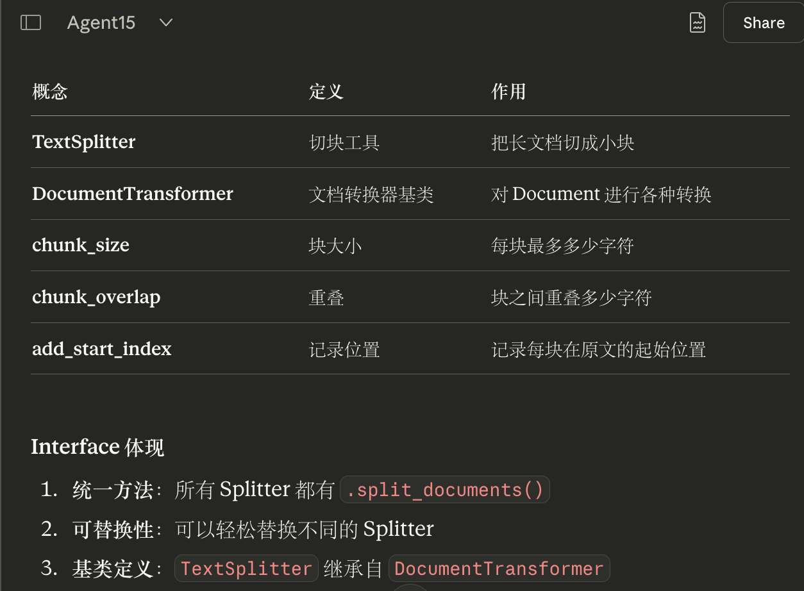

问题：
1 fine-tuning啥意思

## **LangChain 的核心组件有哪些？它们分别是做什么的？**


## # [向量存储和检索器](https://langchain.ichuangpai.com/langchain/tutorial/Vector-stores-and-retrievers.html#%E5%90%91%E9%87%8F%E5%AD%98%E5%82%A8%E5%92%8C%E6%A3%80%E7%B4%A2%E5%99%A8)


### [Retrievers](https://langchain.ichuangpai.com/langchain/tutorial/Vector-stores-and-retrievers.html#retrievers)


问题：
1之后可以学tool
2
### 3. Embeddings Interface（接口）

所有 Embedding 模型都实现了两个核心方法：

python

```python
class Embeddings(ABC):
    @abstractmethod
    def embed_documents(self, texts: List[str]) -> List[List[float]]:
        """
        批量向量化多个文本
        
        输入：["text1", "text2", "text3"]
        输出：[[0.1, 0.2, ...], [0.3, 0.4, ...], [0.5, 0.6, ...]]
        """
        pass
    
    @abstractmethod
    def embed_query(self, text: str) -> List[float]:
        """
        向量化单个文本（通常用于问题）
        
        输入："What is LangChain?"
        输出：[0.2, 0.8, 0.1, ...]
        """
        pass
```

**为什么有两个方法？**

- `embed_documents()`：批量处理，效率高（用于索引 66 个块）
- `embed_query()`：单个处理（用于用户提问）

这个不太理解

### 3. VectorStore Interface（接口）

所有 VectorStore 都实现了这些核心方法：

python

```python
class VectorStore(ABC):
    @abstractmethod
    def add_texts(
        self, 
        texts: List[str], 
        metadatas: Optional[List[dict]] = None
    ) -> List[str]:
        """添加文本到向量库"""
        pass
    
    @abstractmethod
    def similarity_search(
        self, 
        query: str, 
        k: int = 4
    ) -> List[Document]:
        """相似度搜索"""
        pass
    
    @abstractmethod
    def similarity_search_with_score(
        self, 
        query: str, 
        k: int = 4
    ) -> List[Tuple[Document, float]]:
        """搜索并返回相似度分数"""
        pass
    
    @classmethod
    @abstractmethod
    def from_documents(
        cls,
        documents: List[Document],
        embedding: Embeddings
    ) -> "VectorStore":
        """从 Document 列表创建向量库"""
        pass
```


随机知识：
1
记得vscode检查自动保存


vectorstore = Chroma.from_documents(...)  # 对象 1
retriever = vectorstore.as_retriever()    # 对象 2（新创建的）
```

---

## 完整关系图
```
vectorstore (Chroma 对象)
    │
    ├─ 属性/方法：
    │   ├─ similarity_search()  ← 查书方法
    │   ├─ add_documents()      ← 添加书方法
    │   ├─ delete()             ← 删除书方法
    │   └─ as_retriever()       ← 创建 retriever 的方法
    │
    └─ 调用 as_retriever() 后
        ↓
    创建一个新对象
        ↓
retriever (VectorStoreRetriever 对象)
    │
    └─ 属性/方法：
        ├─ invoke()             ← 查书方法（调用 vectorstore.similarity_search）
        ├─ batch()              ← 批量查书
        ├─ stream()             ← 流式查询
        └─ vectorstore          ← 保存了原 vectorstore 的引用


**invoke()和batch()区别

**单次查询（`invoke()`）**

python

```python
result = retriever.invoke("cat")
# 返回：[Document对象]  ← 一个列表，里面是 cat 的搜索结果
```

**一次只能查一个问题**

---

**批量查询（`batch()`）**

python

```python
results = retriever.batch(["cat", "shark"])
# 返回：[[Document对象], [Document对象]]  ← 两个列表
#        ↑第1个问题      ↑第2个问题
```

**一次查多个问题**


**LCEL思想（用｜）：

**每一步的输出 = 下一步的输入**

```
invoke("tell me about cats")  # 最开始的输入
    ↓
字典处理 → 输出字典
    ↓
prompt 填充 → 输出填充后的文本
    ↓
llm 生成 → 输出答案  # 最后的输出
```

**关系图**： ``` 
你之前学的（Agent） ↓ 
create_react_agent(model, tools, ...) ↓ 
内部做了：
1. model.bind_tools(tools) ← 教程在讲这个 
2. 循环调用模型
3. 执行工具 
4. 返回结果 
5. 生成答案

agent = create_react_agent(厨师, [刀, 锅, 炉子])

agent.做菜("炒鸡蛋")

# Agent 自动做：
1. 告诉厨师有哪些工具（bind_tools）
2. 厨师说："我需要锅"
3. Agent 自动拿锅给厨师 ✅
4. 厨师说："我需要炉子"
5. Agent 自动打开炉子 ✅
6. 厨师做完菜
```

---

## 你的理解纠正版

### 你说的（稍微不准确的部分）

> "tools 指的是提供给 agent 可以使用的**模型**"

**纠正**：
- tools 不是"模型"
- tools 是"工具"（搜索、计算器、数据库等）

---

### 正确表述

**`tools`**：
- 提供给 Agent 可以使用的**工具列表**
- 比如：搜索工具、计算器、数据库查询

**`model`**：
- 提供给 Agent 的**大脑**（LLM）
- 负责思考、决策、生成文本

**`.bind_tools()`**：
- 告诉 `model`（大脑）："你可以使用这些 `tools`（工具）"
- 让模型**知道**有工具可用

**`create_react_agent`**：
- 自动执行 `.bind_tools()`
- 自动执行工具
- 自动循环推理

---

## 完整逻辑链（修正版）
```
1. model（大脑）
   ↓
2. tools（工具箱）
   ↓
3. bind_tools（告诉大脑有哪些工具）
   → model_with_tools（知道有工具的大脑）
   ↓
4. 手动执行工具（你要手动做）
   ↓
   agent = create_react_agent(model, tools)（自动化助手）


┌─────────────────────────────────────────┐
│         用户输入（HumanMessage）          │
└───────────────┬─────────────────────────┘
                ↓
┌─────────────────────────────────────────┐
│  Agent 接收 → model_with_tools 判断     │
│  （内部已经 bind_tools）                 │
└───────────────┬─────────────────────────┘
                ↓
         需要工具？
        ╱          ╲
      是             否
      ↓              ↓
┌──────────┐    ┌─────────┐
│调用工具   │    │直接回复  │
│(自动执行) │    └─────────┘
└─────┬────┘
      ↓
┌──────────────┐
│工具返回结果   │
└─────┬────────┘
      ↓
┌──────────────┐
│模型生成答案   │
└─────┬────────┘
      ↓
┌──────────────┐
│返回最终结果   │
└──────────────┘


AI里面提取文本函数

def get_text_content(msg):

    if isinstance(msg.content, str):

        return msg.content

    elif isinstance(msg.content, list):

        for item in msg.content:

            if item.get('type') == 'text':

                return item['text']

    return str(msg.content)

  #  使用
final_text = get_text_content(response["messages"][-1])



流回消息和流回令牌区别：


流回令牌（实时显示字）：
### 场景 2：前端集成（ChatGPT 式界面）

你看 ChatGPT/Claude 网页版，回复是"一个字一个字蹦出来"的，就是用事件流实现的：

python

```python
# 后端（FastAPI）
@app.post("/chat")
async def chat(message: str):
    async def generate():
        async for event in agent.astream_events(...):
            if event["event"] == "on_chat_model_stream":
                yield event["data"]["chunk"].content  # 推送给前端
    return StreamingResponse(generate(), media_type="text/event-stream")
```

javascript

```javascript
// 前端（JavaScript）
const response = await fetch('/chat', {method: 'POST', body: ...});
const reader = response.body.getReader();

while (true) {
    const {value, done} = await reader.read();
    if (done) break;
    const text = new TextDecoder().decode(value);
    document.getElementById('chat').innerHTML += text;  // 逐字显示
}
```


以后混合使用
### 用 DeepSeek 的场景（60%）

✅ **RAG 问答**（不需要搜索）

python

```python
# 内部文档问答
rag_chain = retriever | prompt | deepseek_model
```

✅ **代码生成**

python

```python
# 写代码
code_response = deepseek_model.invoke("写一个快排")
```

✅ **Agent 推理**（不需要实时搜索）

python

```python
# 复杂推理任务
agent = create_react_agent(deepseek_model, [calculator])
```

✅ **文本处理**

python

```python
# 总结、翻译、改写
summary = deepseek_model.invoke("总结这段文字...")
```

---

### 用 Gemini 的场景（40%）

✅ **需要搜索的问题**

python

```python
# 实时信息
weather = gemini_model.invoke("今天天气？")
```

✅ **图片处理**

python

```python
# 看图说话（DeepSeek 做不了）
image_response = gemini_model.invoke([
    {"type": "text", "text": "这是什么？"},
    {"type": "image_url", "image_url": "..."}
])
```

✅ **新闻/时事**

python

````python
# 最新消息
news = gemini_model.invoke("最新 AI 新闻？")
```

---

## 成本对比

### 如果只用 Gemini（免费）
```
成本：¥0
限制：1500 次/天
能力：全面但推理稍弱
```

---

### 如果只用 DeepSeek（你现在）
```
成本：¥10（已花费）
限制：无限制
问题：搜索受 VPN 影响
````
v




先进行RAG数据库构建，再给prompt，
所以RAG里面### [2. 索引：拆分](https://langchain.ichuangpai.com/langchain/tutorial/Build-a-Retrieval-Augmented-Generation-Application.html#_2-%E7%B4%A2%E5%BC%95-%E6%8B%86%E5%88%86)
里面说
**在这种情况下，我们将把文档分成1000个字符的块，块之间有200个字符的重叠。重叠有助于将语句与与其相关的重要上下文分开的可能性。我们使用[RecursiveCharacterTextSplitter](https://python.langchain.com/v0.2/docs/how_to/recursive_text_splitter/)，它将使用公共分隔符递归地拆分文档，例如新行，直到每个块的大小合适。这是通用文本用例的推荐文本拆分器。
这段话关于为什么使用重叠的问题？


**解答：
重叠是为了确保 LLM 看到的每个块都有足够的上下文，能够独立理解这个块在说什么，从而生成准确的答案给我们（用户）。
为了输出prompt（里面有上下文），让LLM能够理解


## RAG检索
关于similarity_search()和as_retriever()区别？



问题：
1
不太理解