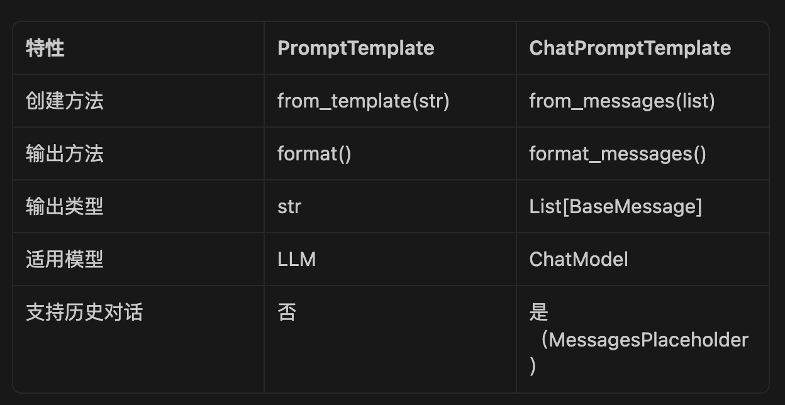
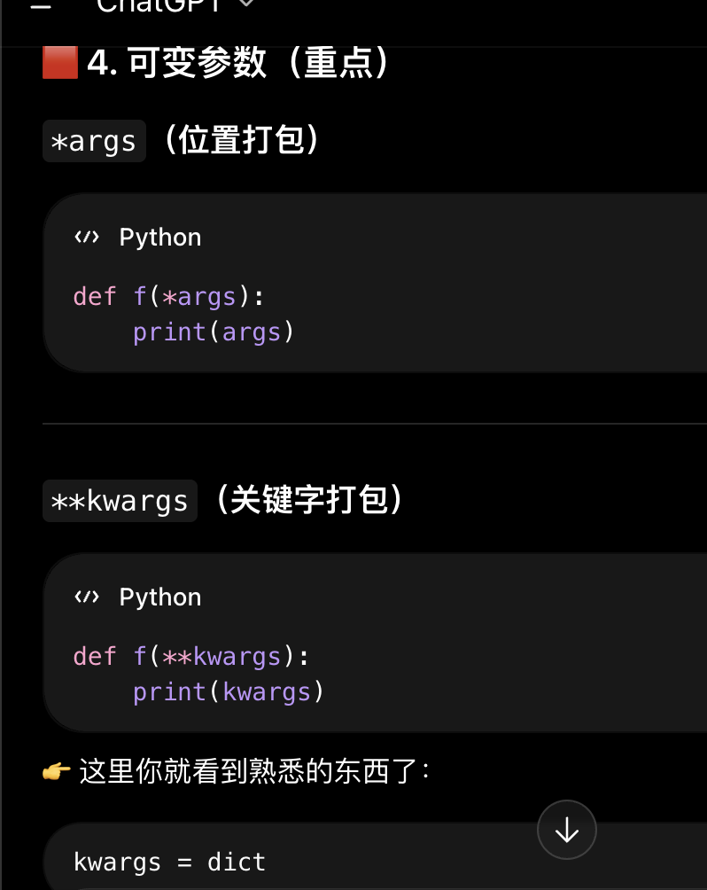
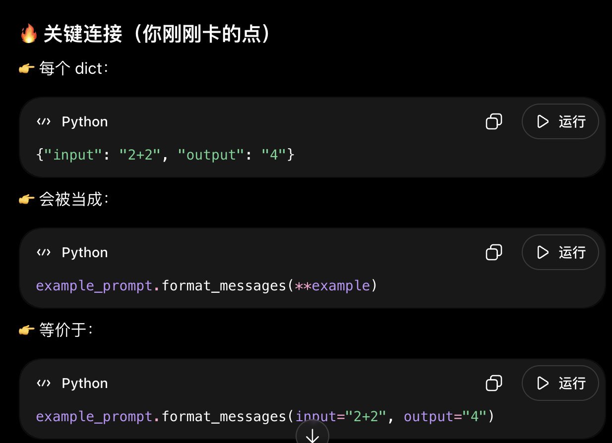
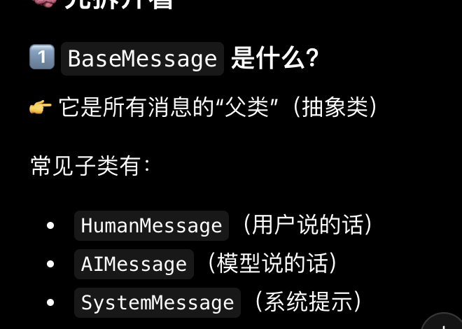
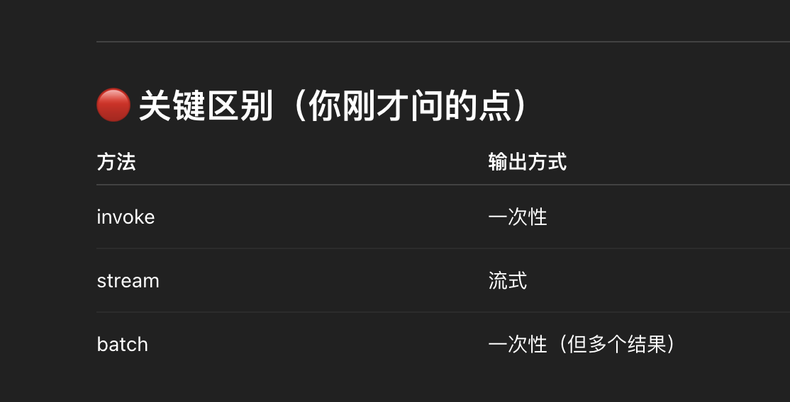
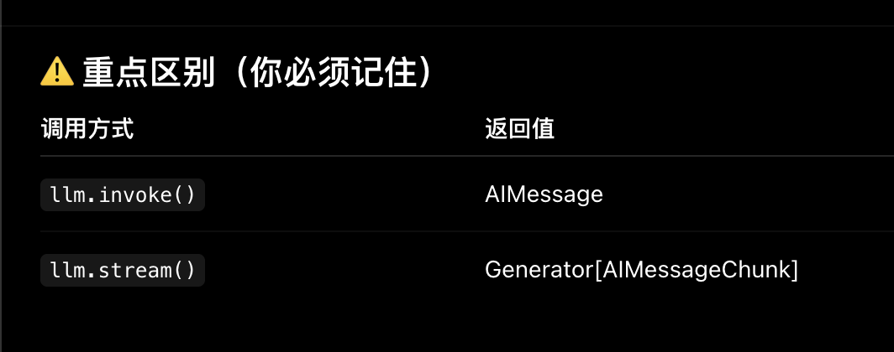
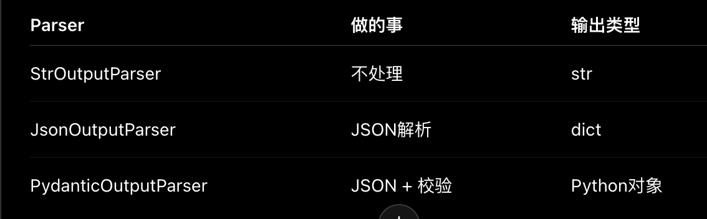
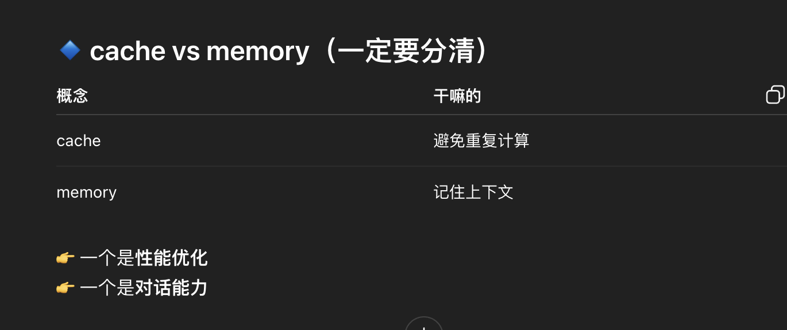
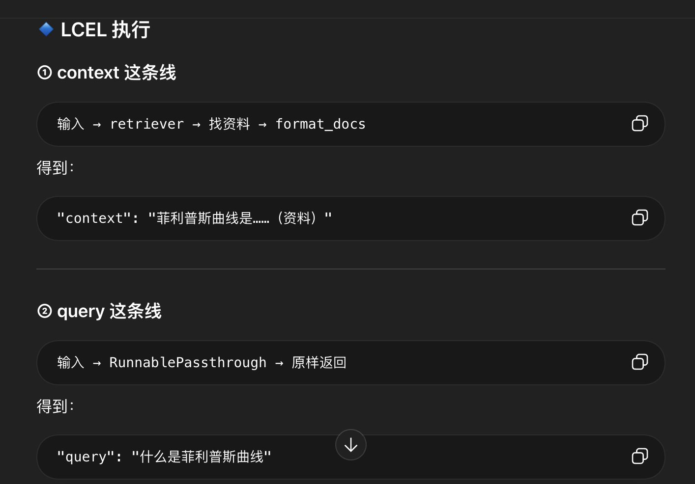
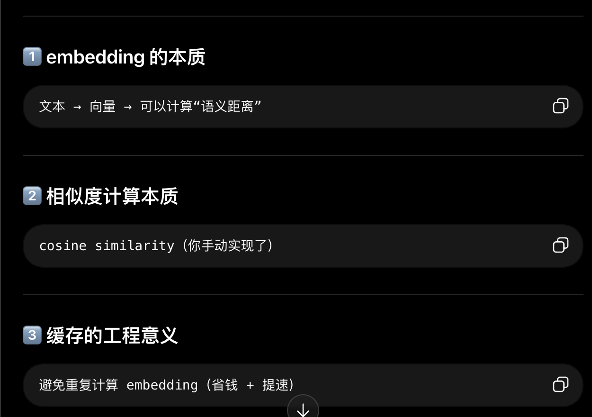

问题：
1
关键词参数相关的问题，在LLM里面学习


2


### 1. PromptTemplate 与 ChatPromptTemplate



**a) PromptTemplate 的输出**：（返回类型是str）

- `PromptTemplate.from_template()` 创建字符串模板
    
- `format()` 方法把 `{topic}` 替换成 `"程序员"`
    
- 返回纯字符串
    

**b) ChatPromptTemplate 的输出**：（返回类型是比如SystemMessage等等）

- `ChatPromptTemplate.from_messages()` 创建消息模板

- 返回消息对象列表（比如HumanMessage或者SystemMessage）

3
**{}👉 占位符（placeholder）就是：一个“先留位置，之后再填值”的标记
4
关于
```
───────────────────

"""什么叫from——template?"""

def exercise_01():

# TODO:

from langchain_core.prompts import PromptTemplate

#{}👉 占位符（placeholder）就是：一个“先留位置，之后再填值”的标记

prompt_Template=PromptTemplate.from_template(

"请用{language}语言写一个{topic}的示例代码"

)

template=prompt_Template.format(language="Python",topic="快速排序")

return template

raise NotImplementedError("请完成第1题")
```
使用guage="Python",topic="快速排序"传递参数：



5



### 2. LLM 与 ChatModel



2
messages = [
    SystemMessage(...),
    HumanMessage("2+2"),
    AIMessage("4"),
]
Chat返回类型都是已经实例的对象

3
```python

# invoke：一次性调用
result = llm.invoke("有什么关于失业和通货膨胀的相关性的理论")
print(result.content)

# stream：流式输出
for chunk in llm.stream("有什么关于失业和通货膨胀的相关性的理论"):
    print(chunk.content, end="", flush=True)

# batch：批量处理
results = llm.batch([
    "介绍一下菲利普斯曲线",
    "介绍一下奥肯定律"
])
for result in results:
    print(result.content)
```
invoke和batch都是一次性输出吗，还是batch和stream一样是流输出，只是batch是多文档处理。

**解答：





、
### 3. OutputParser 与结构化输出

1.OutPutParser解析器用法：



2
**retriever(向量检索器)返回：

短答案：**大多数 `retriever` 默认返回 `List[Document]`，但不是“所有情况都只能这样”。**


### 4. LCEL 链式调用
#### 易错：
1


cache是缓存的意思

2
**RunnablePassthrough()作用：

当你执行：
```python
chain.invoke("问题")
```

内部会变成：
```python

context = (retriever | format_docs).invoke("问题")  
query = RunnablePassthrough().invoke("问题")
```

3
	**query和context的含义：



```

RunnablePassthrough 的作用：
chain = {
    "context": retriever | format_docs,
    "query": RunnablePassthrough()
}
→ 输入的 query 会原样传递
→ retriever 处理后的结果赋给 context
→ 下游组件同时收到 context 和 query
```

4
**这个partial_variables={"format_instructions"作用：
```python
prompt = PromptTemplate(
    template="根据用户的输入进行解答.\n{format_instructions}\n{query}\n",
    input_variables=["query"],
    partial_variables={"format_instructions": parser.get_format_instructions()},
)
```


```python

1. parser.get_format_instructions()
   → "The output should be formatted as JSON..."
   
2. 插入到 prompt
   → 模型看到格式要求
   
3. 模型输出 JSON
   → {"setup": "...", "punchline": "..."}
   
4. parser.parse(output)
   → Joke(setup="...", punchline="...")
```

### 6. Embeddings




问题：
1
高效做“近似最近邻搜索”（ANN
感觉好高级

2
  

- `db.as_retriever(search_type, search_kwargs)` — 把 VectorStore 转成 Retriever

- `MultiQueryRetriever.from_llm(retriever, llm)` — 多查询检索器

- `ContextualCompressionRetriever(base_compressor, base_retriever)` — 压缩检索器

- `LLMChainExtractor.from_llm(llm)` — LLM 压缩器

- `BM25Retriever.from_documents(documents)` — BM25 检索器

- `EnsembleRetriever(retrievers, weights)` — 混合检索器

高级


**想法：
  
我觉得

** 高级 Retriever
**是什么**：

更复杂的检索策略：MultiVector（摘要/假设问题检索）、ParentDocument（子块检索返回父文档）、SelfQuery（元数据过滤）。

**为什么需要它**：

基础检索有局限：

- 用户问题和文档表述可能完全不同（问题是"怎么做"，文档是"步骤"）

- 检索到的小块可能上下文不足

- 文档有结构化信息（时间、类别），但普通检索用不上

在后面的agent用得上


**MultiVectorRetriever 的假设问题检索和摘要检索区别和使用

**摘要检索：
做法：
文档 → LLM总结 → embedding
查询：
query → embedding → 和“总结”比


**假设问题检索：（模拟询问）
做法：
文档 → LLM生成“可能被问的问题” → embedding
查询：
query → embedding → 和“这些问题”比

**真正使用是混合使用（在Agent里面使用合适的，匹配精确度更高）：   

模糊、口语、各种表达使用Hypothetical Questions

结构化、专业术语使用Summary


3
