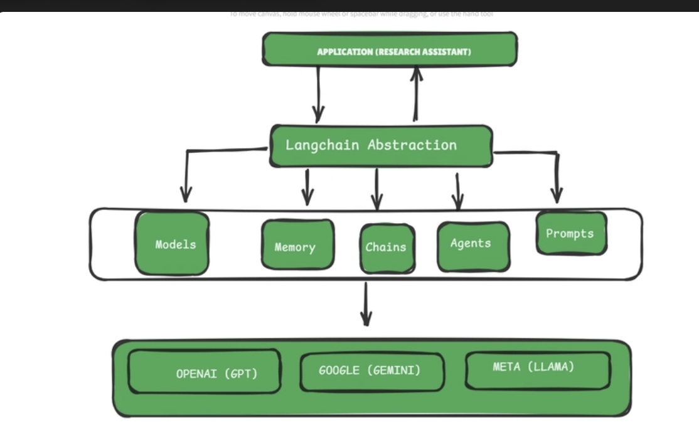
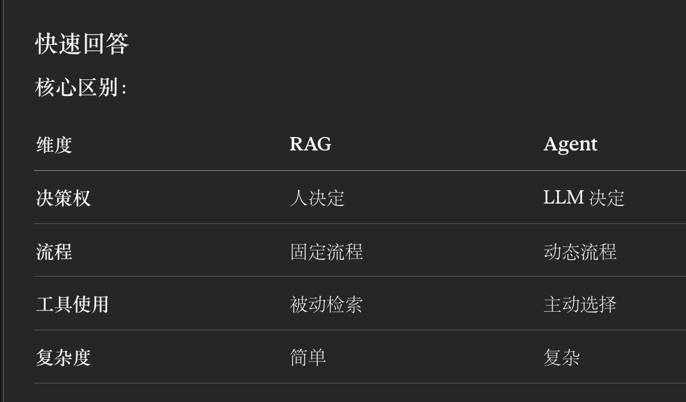
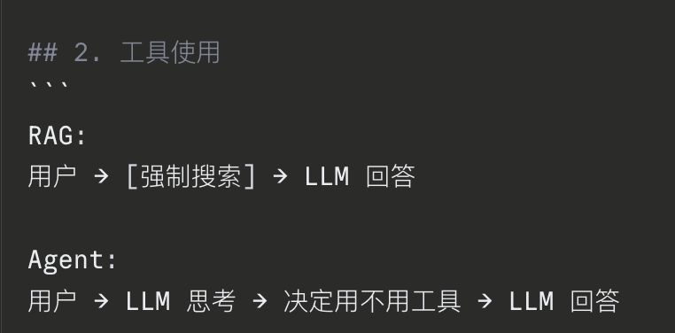

Problems（我之后可以考虑的）

**Memory Management**: LLMs don't remember previous conversations by default. You need to manually manage conversation history, decide what to keep and what to discard, and handle the token limits that constrain how much context you can provide.

**Integration Complexity**: Your research assistant needs to work with different document formats (PDFs, Word docs, web pages), connect to various LLM providers (OpenAI, Google, Anthropic), and potentially integrate with databases, search engines, and other APIs.

**Prompt Engineering**: Crafting effective prompts is both art and science. You need different prompting strategies for different tasks, error handling when LLMs produce unexpected outputs, and ways to ensure consistent behavior across different interactions.

**Data Processing Pipeline**: Documents need to be loaded, split into manageable chunks, converted into searchable formats, and retrieved efficiently when users ask questions. This involves understanding vector embeddings, similarity search, and information retrieval concepts.

问题：
### Limitation 1: Context Window Constraints
————LangChain记忆管理系统

### Limitation 2: Knowledge Cutoffs and Hallucinations
—————
Retrieval Augmented Generation (RAG), which allows LLMs to access external knowledge sources. It provides tools for web search, database queries, and document retrieval, enabling LLMs to work with current and accurate information rather than relying solely on training data.（终于理解了RAG的内容）
### Limitation 3: Lack of Tool Use and Action Capabilities
### Limitation 4: Inconsistent Output Formats

做agent这些要关注吗？

感悟

容易混淆的点

补充工具使用：

面试问题：
1
RAG和Agent有什么不同？

好！给你**面试标准答案**：

---

## 问题 1：Agent 开发必须深入学的组件

**标准答案：**

Agent 开发的核心组件是：**Prompts、Memory、Agents**

- **Prompts**：设计 Agent 的推理逻辑和决策指令
- **Memory**：维持多轮对话的上下文状态
- **Agents**：实现 LLM 的工具选择和执行流程

Models 用于接口调用，Chains 在 Agent 场景中优先级较低。

---

## 问题 2：LLM 限制及 LangChain 解决方案

**标准答案：**

1. **Context Window 限制**  
    解决方案：Memory 管理系统实现对话压缩，文档切分策略控制输入大小，检索系统筛选相关信息
    （- Memory：管理"对话历史"（用户说了什么、AI 回了什么））
    
2. **Hallucinations（知识过时、事实错误）**  
    解决方案：RAG（Retrieval Augmented Generation）架构，通过外部知识库检索提供 grounded 的事实依据
    
3. **无法执行操作**  
    解决方案：Agent 框架，LLM 通过推理决定工具调用时机和参数，代码层执行实际操作
    
4. **输出格式不稳定**  
    解决方案：Output Parsers 强制结构化输出，Prompt Templates 引导格式规范，Validation 层验证合规性
    （
LangChain 解决方案： 1. Output Parsers：强制解析成固定格式 2. Prompt Templates：引导 LLM 按格式输出 3. Validation：验证输出是否符合要求）
    

---

## 问题 3：RAG vs Agent 核心区别

**标准答案：**

**决策权归属不同：**

- **RAG**：固定流程，开发者预定义检索逻辑，LLM 仅负责基于检索结果生成文本
- **Agent**：动态决策，LLM 自主判断是否需要工具、选择何种工具、决定执行顺序

**流程特性：**

- RAG 是 deterministic pipeline（确定性管道）
- Agent 是 adaptive workflow（自适应工作流）

---

## 问题 4：场景判断

**标准答案：**

**场景 A：RAG**  
理由：查询模式单一且固定，所有请求均需文档检索，不需要动态决策，RAG 的固定管道架构更高效且可预测

**场景 B：Agent**  
理由：任务类型多样化，需要 LLM 进行工具选择决策（天气 API、计算器、搜索引擎等），可能需要多步推理和工具链组合，Agent 的自适应能力是必需的（重点是自适应能力）

---

## 问题 5：不需要学习的内容

**标准答案：**

**B、D、F**

理由：

- **B（Transformer 架构）**：属于模型内部实现细节，Agent 开发只需调用 API 接口层
- **D（RLHF）**：属于模型训练方法论，与 Agent 应用层开发无关
- **F（模型训练）**：属于 ML 工程领域，Agent 开发使用预训练模型的推理能力

Agent 开发聚焦于**应用层编排**，而非**模型层研究**。

---

## 补充：核心概念辨析

### Memory vs 向量数据库

- **Memory**：会话状态管理，存储对话历史和上下文
- **向量数据库**：知识检索后端，存储文档 embeddings 用于语义搜索

二者职责不同，分别服务于对话连贯性和知识检索。

### RAG 的本质

RAG 是一种**增强生成架构**，通过检索模块为生成模块提供外部知识支撑，解决 LLM 的知识边界和时效性问题。

### Agent 的本质

Agent 是一种**推理-执行框架**（ReAct: Reasoning + Acting），LLM 作为推理引擎，通过 Thought-Action-Observation 循环实现目标导向的任务完成。

---

**这是面试标准回答模式：简洁、精准、专业术语准确** 🎯