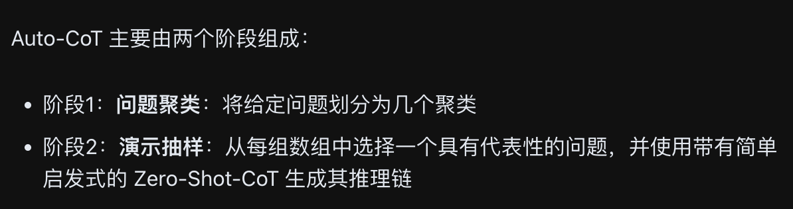
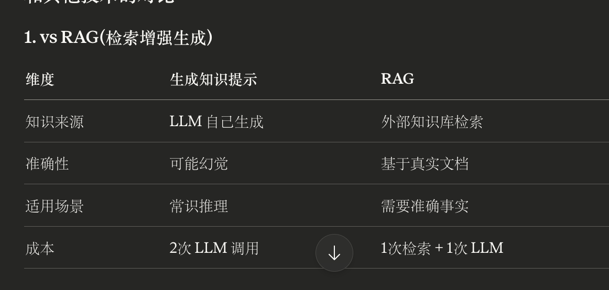
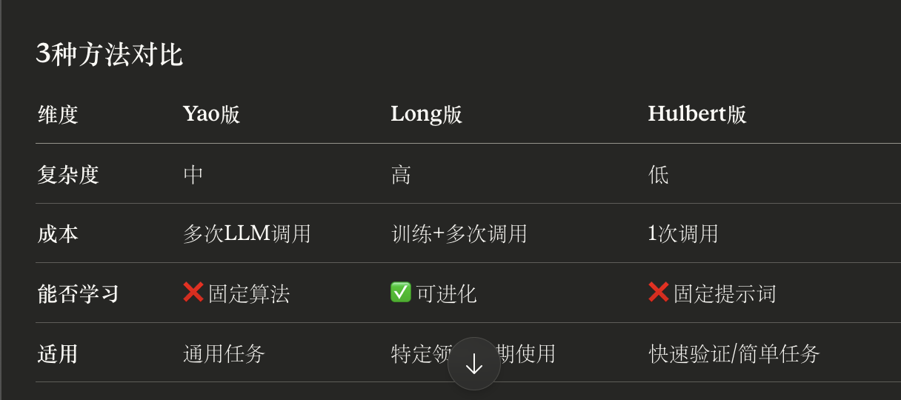
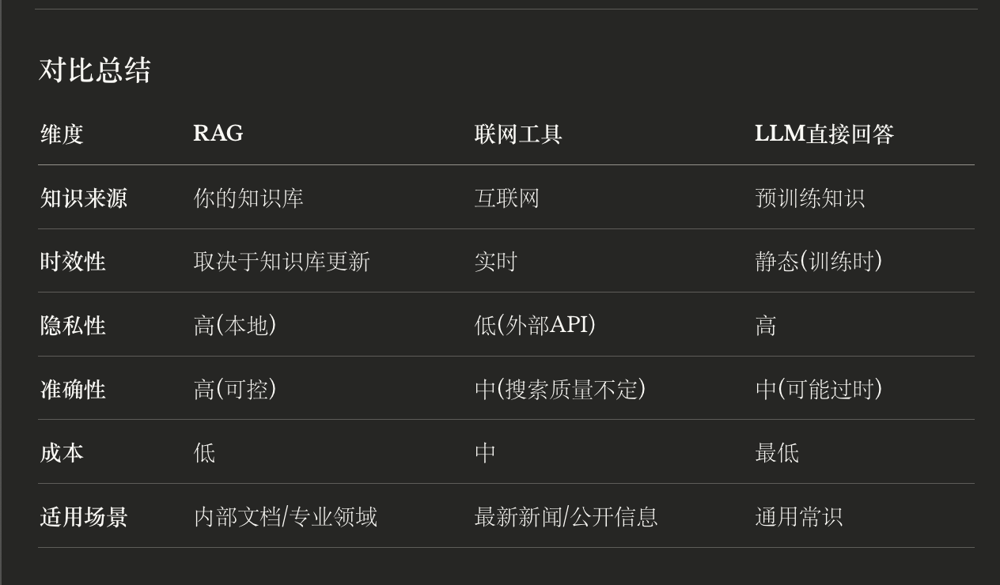
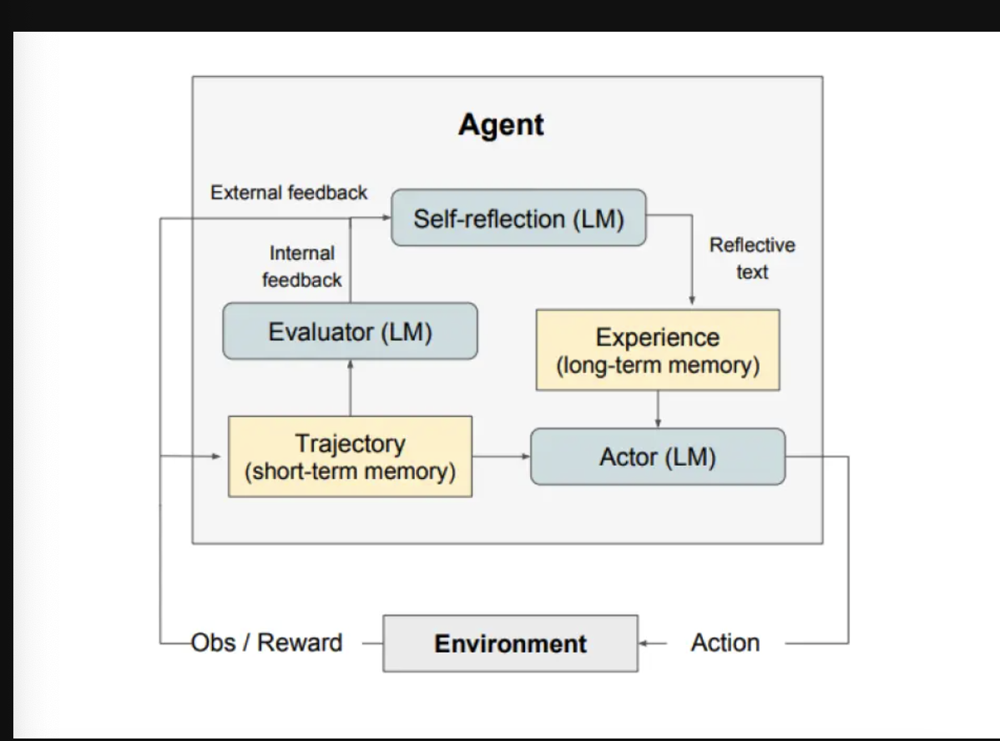
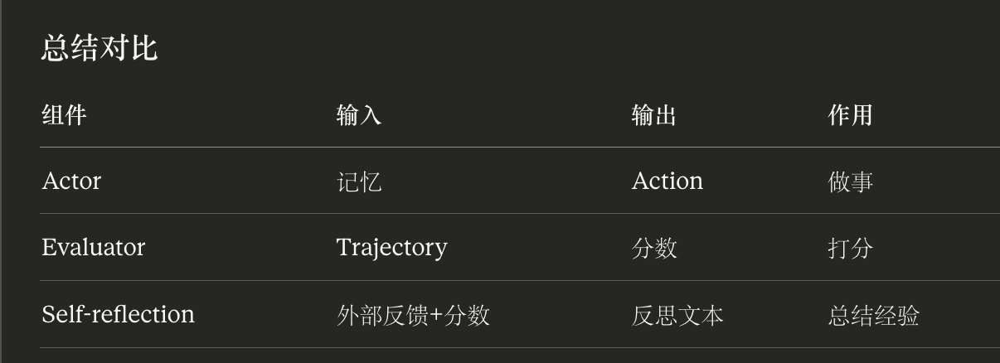
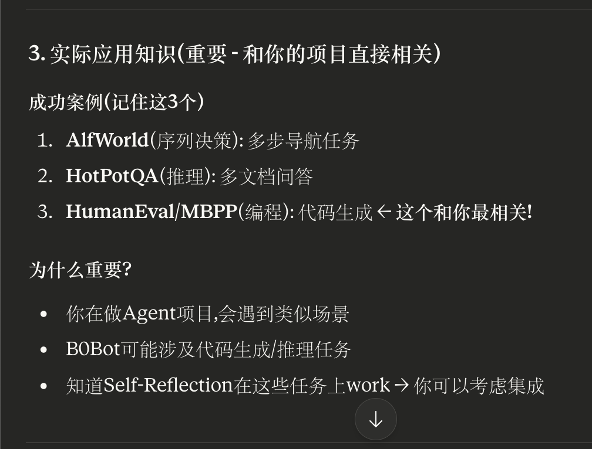

### 少样本提示

**对于下面这段话的理解：
- “标签空间和演示指定的输入文本的分布都很重要（无论标签是否对单个输入正确）”
- 使用的格式也对性能起着关键作用，即使只是使用随机标签，这也比没有标签好得多。
- 其他结果表明，从真实标签分布（而不是均匀分布）中选择随机标签也有帮助。

第一句话，第3句话理解：

标签空间指：运行模型输出的答案内容（关于答案，可能是词）
演示指定的输入文本的分布：给模型例子样本涵盖的范围（关于句子）

**给的例子和对应答案不对应，仍然可以正确输出，为什么？
1. 标签空间告诉模型"输出格式"(只能输出这两个词)
2. 输入分布告诉模型"输入范围"(什么样的句子会被拿来分类)
3. **标签比例要模仿真实世界**(如果现实是 8:2,例子里也保持 8:2)
4.  具体的正确对应关系,模型会用**预训练知识**补上

第二句话理解：

**格式的价值在于:**

1. 帮 LLM 识别"这是个什么类型的任务"
2. 定义"输出应该长什么样"
3. 给 LLM 一个"调用预训练知识"的入口

所以跟给模型的答案什么的没关系，让模型识别更重要。


### 链式思考（CoT）——prompt加入think step by step

它对具有多样性的问题进行采样，并生成推理链来构建演示。

有零样本CoT和少样本CoT

关于Auto-CoT相关问题：



执行前LLM从自身的任务聚集库里面获取，然后进行阶段1和阶段2，生成供LLM参考的prompt，无需人工给多个少样本提示

### 自我一致性

**自我一致性 = Few-Shot + CoT + 多次采样投票**

```
技术栈叠加:
├─ 基础: Few-Shot Prompting(给例子)
├─ 第1层: Chain-of-Thought(要求逐步推理)
└─ 第2层: Self-Consistency(生成多个答案,投票选最常见的)
```

延伸问题：

**为什么要设置 temperature > 0?

python

```python
# 低 temperature(确定性采样)
outputs = [
    call_llm(prompt, temperature=0),  
    call_llm(prompt, temperature=0),
    call_llm(prompt, temperature=0),
]
# 结果: 3次输出完全一样! 投票没意义
```

python

```python
# 高 temperature(随机性采样)  
outputs = [
    call_llm(prompt, temperature=0.7),  
    call_llm(prompt, temperature=0.7),
    call_llm(prompt, temperature=0.7),
]
# 结果: 3次输出不同,探索了不同推理路径
```

**关键:** temperature > 0 让 LLM 每次选择不同的推理方式,增加多样性


### 生成知识提示

LLM能够通过融合知识或信息，以帮助模型做出更准确的预测



**问题：针对LLM可能生成多个知识版本,后面调用LLM是知识一起询问，还是各知识分开询问

**答:** ✅ **分开询问**

**流程:**

1. 生成多个知识(知识1, 知识2, ...)
2. **每个知识单独调用一次LLM**:
    - Prompt A = 问题 + 知识1 → 答案1
    - Prompt B = 问题 + 知识2 → 答案2
3. 比较答案质量/置信度,选最好的

**为什么:**

- 评估每个知识的有效性
- 避免知识冲突混淆LLM
- 类似Self-Consistency的投票机制


### 链式提示（prompt chaining）

一个任务被分解为多个子任务，根据子任务创建一系列提示操作。

### 思维树 (ToT)



### RAG



### ART

ART（Automatic Reasoning and Tool-use）的工作原理如下：

- 接到一个新任务的时候，从任务库中选择多步推理和使用工具的示范。
- 在测试中，调用外部工具时，先暂停生成，将工具输出整合后继续接着生成。

 ————核心：边推理边调工具,每次调工具要暂停


**对于ART采用0样本式例的理解：

任务库(有示例) → 总结模式 → 应用到新任务(0-shot)
     ↑                              ↑
  不是0-shot                     这里是0-shot


### APE

**APE = 让LLM自己设计和优化提示词**

**过程:**

1. LLM生成候选提示词(Inference)
2. LLM给候选打分(Scoring)
3. 保留好的,淘汰差的
4. 基于好的生成变体(Resampling)
5. 找到最优提示词


### Active-Prompt

**Active-Prompt = 让LLM自己暴露弱点,然后针对性地提供示例**

**4步流程:**

1. **测不确定度** (让LLM答k次,看答案分散程度)
2. **选最不确定的** (LLM最迷糊的问题)
3. **人工标注** (专家写详细推理)
4. **用作示例** (Few-Shot推断)

**优势:** 示例更有针对性,而不是随机选!


### 方向性刺激提示

**多次调用LLM：

输入: 一篇CNN文章(Bob Barker的新闻)
    ↓
┌─────────────────────┐
│ 调用1: 策略LM        │
│ 任务: 提取关键信息    │
│ 输出: Hint          │
└─────────────────────┘
    ↓
Hint = "Bob Barker; TV; April 1; The Price Is Right; 2007; 91"
    ↓
┌─────────────────────────────────┐
│ 调用2: 大LLM                     │
│ 输入: [原文章] + [Hint]          │
│ Prompt: "基于hint总结2-3句"      │
│ 输出: 摘要                       │
└─────────────────────────────────┘
    ↓
摘要: "On April 1, Bob Barker returned..."


### PAL（程序辅助语言模型）

**PAL(Program-Aided Language Models)的核心思想:

```
传统方法:
问题 → LLM直接输出答案
问题: LLM数学不好,容易算错

PAL方法:
问题 → LLM生成Python代码 → exec()执行代码 → 得到准确答案
好处: 计算交给Python,不会算错!
```

### 自我反思（Reflexion）——把错误总结成文字,塞进下次prompt


- **Self-reflection (LM)**
    - 功能: 接收外部/内部反馈 → 生成反思文本（存到长期记忆里面）
- **Evaluator (LM)**
    - 功能: 评估当前轨迹 → 生成内部反馈
- **Actor (LM)**
    - 功能: 读取记忆 → 生成Action发给环境



**启发：我觉得这个多LLM之后应用到我的Agent里面

**为什么说"CoT和ReAct被用作参与者模型"?

- **Actor内部使用CoT或ReAct的prompt策略**来生成行动
- 不是说CoT/ReAct是单独的模块,而是Actor这个LLM **采用了CoT/ReAct的推理方式**


### Function Calling


角色说明

+ 任务说明

+ 示例

+ 重复关键点

+ 额外信息

+ 正向鼓励


问题：
2
temperature=0底层？
4
以后让codex 去安装东西
6
后面有点看不懂啊
7
ToT是什么？要学吗？
8
后面学习tools
9
怎么解决大模型的不可控性？

10
已经快忘记BFS或者DFS在讲什么了
（之前这方面也有缺，感觉要回去学习复习一下了）


感悟

2感觉自己在LangChain学过类似的内容，我觉得要复习一下memory上下文内容的

5
ToT，自洽性和思维链
解决

6以后可以自己使用AI的时候，使用JSON类似格式的输出，再返回输入。


